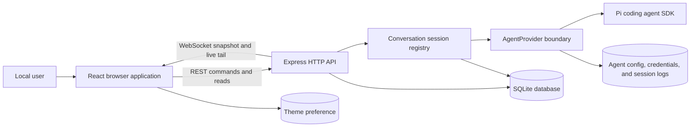
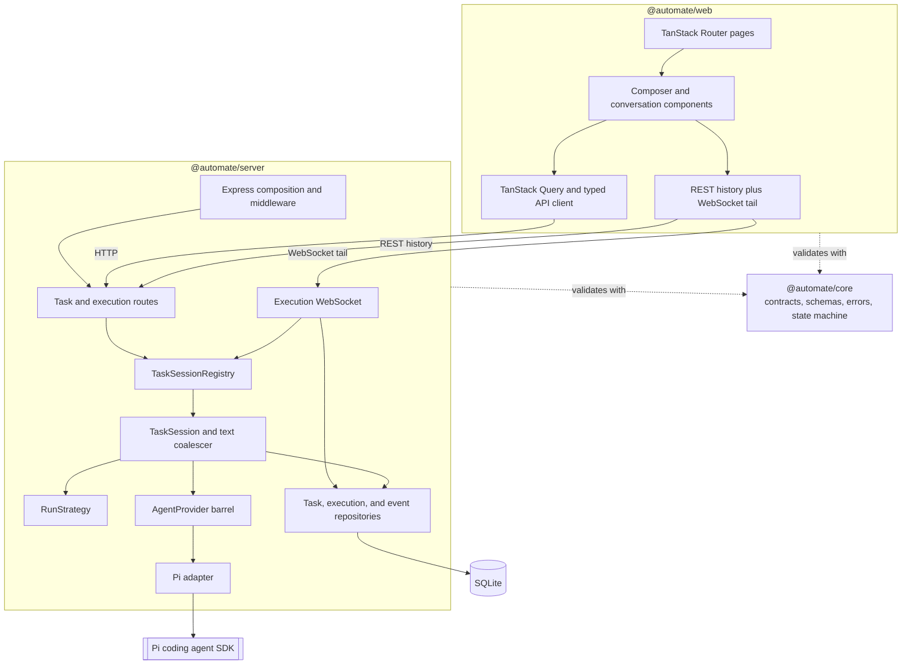
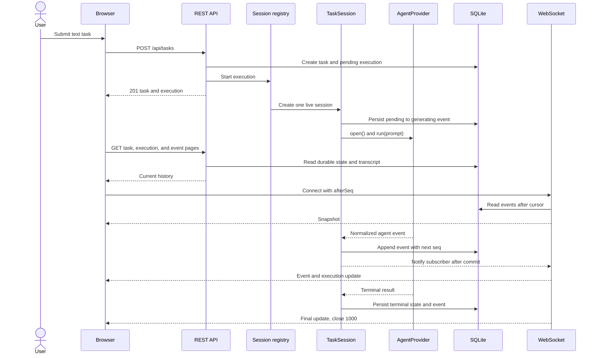
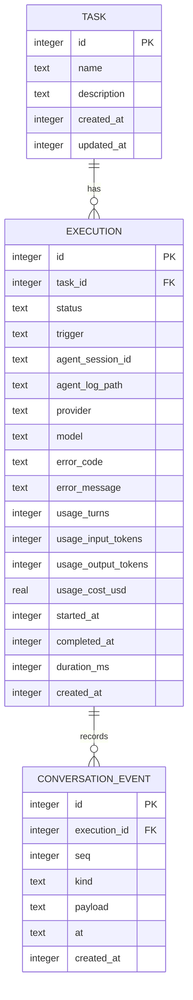

<!-- Generated by spec-lite | skill: document-design -->

# Architecture

## System Context

Auto-Mate is a single-user, local developer preview. The React shell provides task creation, task conversations, History navigation, agent Settings, theme control, and server health status. A person can enter a text-only task, follow the agent conversation, and cancel the active run. The browser uses REST for commands and durable reads and a WebSocket for the server-to-client live tail. The Express server is the authority for task state, execution state, event ordering, and restart recovery.

The server reaches `@earendil-works/pi-coding-agent` only through Auto-Mate's SDK-independent `AgentProvider` contract. Provider events are normalized and sanitized before the conversation layer sees them. The application persists the transcript in SQLite before broadcasting it; the Pi session JSONL remains a local debugging artifact and is never the rendered transcript or an API response.

FEAT-103 sends only the words typed into the task composer. It has no upload control, disclosure flow, generated-code workflow, script runner, or artifact renderer. The loopback bind and request-origin checks protect the local application surface, but they are not a generated-code isolation boundary.

## Components

The pnpm workspace has three TypeScript ESM packages with one-way dependencies from the web and server packages into the browser-safe core package.

- `@automate/core` owns TypeBox API schemas, the seven-member `ConversationEvent` contract, the WebSocket message union, typed errors, and the execution transition table. It imports no Node or provider SDK types in the conversation boundary.
- `@automate/web` owns the React 19 shell, TanStack Router pages, TanStack Query data access, and the conversation presentation. The New task route contains a text composer; `/tasks/$taskId` renders ordered user, assistant, tool, turn, state, and failure events. `/settings` reads and updates provider/model selection and runs a live connection test, while the shell polls server health. Assistant markdown is rendered without raw HTML, tool payloads render as text, and links open with restrictive `rel` attributes. Semantic `ds.*` tokens provide styling.
- `@automate/server` owns startup, Express routes, SQLite repositories, live sessions, transport, and the Pi adapter. It exposes health, agent configuration, task, execution, replay, and abort routes. Routes depend on repositories and the conversation or agent barrels rather than directly on provider SDK internals.

`TaskSessionRegistry` enforces one live `TaskSession` per execution and the configured concurrency limit. A `TaskSession` opens one provider session, records session provenance, consumes normalized events, coalesces consecutive assistant deltas at 100 ms or 1 KiB boundaries, assigns the next per-execution sequence number, persists the event, and then notifies live subscribers. `PassthroughRunStrategy` currently sends the task description unchanged and registers no custom tools; later generation behavior can replace this strategy without changing session orchestration.

The transport boundary is intentionally split. State-changing commands use REST so they pass through correlation-ID error handling and the Origin/Host guard. The WebSocket is server-to-client application traffic only: it sends an initial snapshot, event messages, and execution summaries; inbound application frames are ignored. It also owns heartbeat cleanup and closes slow consumers with a retryable close code.

## Data Flow

Creating a task is an asynchronous handoff. `POST /api/tasks` validates the prompt, checks registry capacity, and creates the task and its first pending execution in one SQLite transaction. The registry starts the run without making the HTTP response wait for completion. The browser navigates to the task page, loads task/execution state and paged transcript history over REST, then opens `/api/ws/executions/:id?afterSeq=N` from the last durable sequence it holds.

During a run, the execution moves from `pending` to `generating`, and then to `completed`, `failed`, or `aborted`. `waiting`, `verifying`, and `executing` are valid persisted values reserved for later implemented features, but FEAT-103 gives them no outgoing transitions. Each application or normalized agent event is appended to `conversation_event` before it is sent to subscribers. The WebSocket supplies a snapshot for the REST-to-socket race window and then the live tail. The browser ignores already-seen sequence numbers; if it detects a gap, receives backpressure close code `1013`, or comes back online, it reloads durable history and reconnects with its cursor.

Cancellation uses `POST /api/executions/:id/abort`. The registry delegates to the live provider session and returns the settled execution. A terminal execution returns `EXECUTION_NOT_RUNNING`; a non-terminal database row with no live session returns `EXECUTION_INTERRUPTED`.

Recovery has explicit outcomes:

| Event                       | Implemented outcome                                                                                                                                                        |
| --------------------------- | -------------------------------------------------------------------------------------------------------------------------------------------------------------------------- |
| Browser disconnect          | The server-side run continues. Reconnection replays events after the browser's last sequence and resumes the live tail.                                                    |
| Server restart during a run | Before listening, startup marks every active execution `failed` with `EXECUTION_INTERRUPTED` and appends a final `state_changed` event. Provider sessions are not resumed. |
| Graceful shutdown           | The registry asks every live session to abort, waits up to five seconds, and marks any still-active row interrupted before closing sockets and SQLite.                     |
| Slow or half-open socket    | Backpressure closes with `1013` so the browser reloads history; heartbeat terminates a connection after two missed pong intervals.                                         |
| Multiple browser clients    | Each client receives the same persisted sequence; disconnecting one subscription does not stop the execution or other clients.                                             |

## Data Model

SQLite is the durable source for application metadata, task definitions, execution summaries, and the displayed conversation. Drizzle defines the schema and the server applies committed migrations in-process. The connection enables WAL and foreign-key enforcement.

- `task` stores the trimmed plain-language request and a deterministic display name derived from its first useful line.
- `execution` owns the state machine, provider/model provenance, optional sanitized failure, optional usage, and timings. Its `agent_log_path` is persisted for local diagnostics but excluded from browser contracts.
- `conversation_event` is the append-only transcript. `(execution_id, seq)` is unique and indexed; `seq` is the replay cursor and browser deduplication key. `payload` stores the complete JSON event, while `kind` and `at` support integrity and inspection.
- Deleting a task cascades to its executions and events. `execution(task_id)` supports task history, and a partial index over active statuses supports restart reconciliation.
- `app_meta` remains the key/value store for schema version, application version, and installation time. Drizzle also maintains its migration table.

The broader `.spec-lite/data_model.md` remains a proposal and includes deferred tables that are not present. There are currently no upload, artifact, schedule, template, tool, clarification, code-version, verification, or script-run tables.

## Key Design Decisions

- **Shared application contracts:** TypeBox schemas, browser-safe types, and typed errors live in `@automate/core`, so the browser and server validate the same health, agent, task, execution, event, and error shapes.
- **One agent seam and one SDK adapter:** Application code consumes `AgentProvider.open(options)` and normalized events. Pi session construction and model lookup stay under `packages/server/src/agent/adapters/pi/`; ambient Pi settings, prompts, skills, and extensions are not loaded into an Auto-Mate session.
- **Application-owned configuration:** Provider/model selection lives in `config/agent.json`; managed credentials live under `pi/`, or the user can opt into a personal Pi credential file. Credential values are not returned by APIs, rendered, or logged.
- **Explicit local storage boundary:** `AUTOMATE_HOME` overrides `~/.automate/`. OS-aware path construction and `resolveWithin` keep execution session directories beneath `agent-sessions/`. SQLite uses `node:sqlite` behind Drizzle with WAL and foreign keys.
- **Correlated API errors:** Middleware accepts a bounded inbound correlation ID or creates one, and one error handler returns the stable public envelope while hiding unexpected internal details.
- **Application-owned React conversation UI:** FEAT-103 does not adopt `@earendil-works/pi-web-ui`. React components render Auto-Mate's normalized event contract directly, avoiding a second browser-side Pi stack and keeping SDK types behind the server adapter.
- **Server-owned replayable state:** SQLite, not the browser or raw Pi JSONL, is authoritative. A single live writer assigns a monotonic per-execution `seq`, and the database uniqueness constraint catches violations.
- **Persist before broadcast:** A client never receives a conversation event that cannot subsequently be replayed from the database.
- **REST commands, WebSocket progress:** Commands retain correlation IDs, validation, and the common error envelope. The socket is a resumable, server-to-client tail rather than a second command API.
- **Explicit restart semantics:** In-memory provider sessions are not reconstructible. Startup therefore converts active rows to a readable interrupted failure instead of leaving stale `generating` state or pretending to resume.
- **Origin and Host validation:** State-changing REST routes and WebSocket upgrades accept the local application origins plus explicitly configured origins. Missing Origin is allowed for non-browser clients; an unrecognized or `null` Origin is rejected. This mitigates browser cross-site requests and DNS rebinding against the loopback service, but it is not authentication or code isolation.
- **Bounded live transport:** Assistant deltas are coalesced before sequencing, socket buffers are capped, and heartbeat cleanup prevents abandoned clients from consuming resources indefinitely.
- **Configurable preview concurrency:** `AUTOMATE_MAX_CONCURRENT_EXECUTIONS` defaults to one. The value is provisional pending the wider operational-limits decision.
- **Safe presentation boundary:** Raw HTML is disabled for model markdown, tool input/output is text, raw provider logs are not served, and API summaries expose no session-log path. Normalized provider payloads have already crossed FEAT-102's sanitizer.

## Deployment and Runtime

`pnpm dev` starts the Express process through `tsx watch` and the Vite development server together. Express defaults to `127.0.0.1:4317`; Vite serves the SPA at `127.0.0.1:5173` and proxies `/api` to the server. The application requires Node `>=24.15.0 <25`, uses a committed pnpm lockfile, and is ESM-only.

Startup runs prerequisite checks, resolves `AUTOMATE_HOME` (default `~/.automate/`), creates the durable directory layout, opens SQLite, applies migrations, composes repositories and the provider, reconciles interrupted executions, then begins listening and attaches the execution WebSocket to the same HTTP server. `SIGINT` and `SIGTERM` drain live sessions before detaching sockets and closing the database.

| Setting                              | Runtime effect                                                           |
| ------------------------------------ | ------------------------------------------------------------------------ |
| `AUTOMATE_HOME`                      | Overrides the application data root.                                     |
| `AUTOMATE_HOST`, `AUTOMATE_PORT`     | Set the Express bind address and port.                                   |
| `AUTOMATE_MAX_CONCURRENT_EXECUTIONS` | Sets the positive integer live-session cap; default `1`.                 |
| `AUTOMATE_ALLOWED_ORIGINS`           | Adds comma-separated browser origins accepted by the local-access guard. |
| `LOG_LEVEL`                          | Sets Pino logging verbosity.                                             |

Durable state lives under the application data root: `data/automate.db`, `config/agent.json`, managed Pi files under `pi/`, and raw SDK logs under `agent-sessions/<executionId>/`. Startup also creates `uploads/`, `artifacts/`, `scripts/`, and `env/`, but FEAT-103 does not use them.

`pnpm build` type-checks core and server and builds the Vite client. The repository still has no production static-file host, container configuration, authentication layer, or restricted script-execution boundary.
