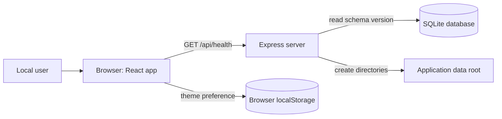
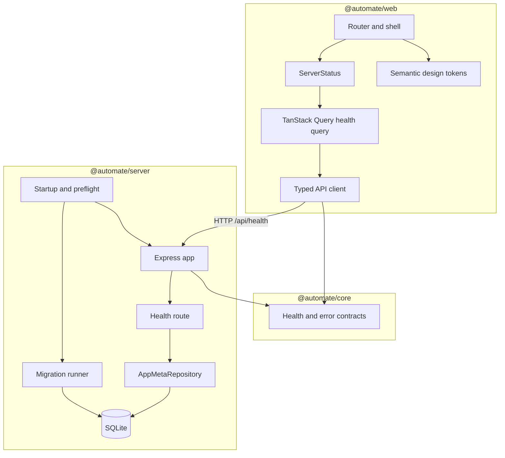
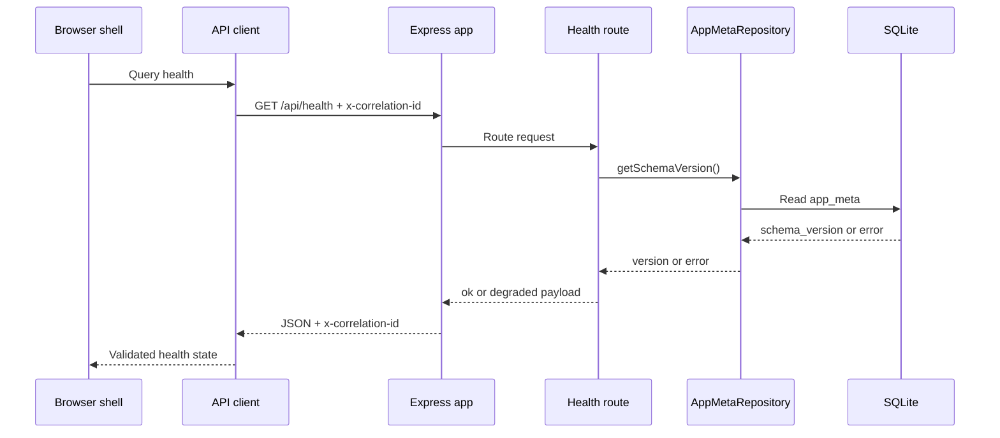

<!-- Generated by spec-lite | skill: document-design -->
# Architecture

## System Context

Auto-Mate currently runs as a single-user, local developer preview. The browser app provides a navigation shell, theme control, and server status. The Express server checks its prerequisites at startup, prepares local storage, applies a SQLite migration, and exposes a health endpoint. The New task, History, and Settings pages are placeholders; task execution, AI integration, uploads, and provider settings are not implemented in this bootstrap.

## Components

The pnpm workspace has three TypeScript ESM packages. `@automate/core` exports the TypeBox health and error contracts and the application error hierarchy. Both `@automate/web` and `@automate/server` import that package; the web package does not import server code.

`@automate/web` mounts a React 19 app with TanStack Router file routes and a TanStack Query provider. The shared shell contains links to the three placeholder pages, a theme toggle, and `ServerStatus`. The API client validates the health payload against the shared schema and turns the shared error envelope into `AutoMateError`. Components use semantic class names from `design-system/tokens.ts`, backed by light and dark CSS variables.

`@automate/server` composes correlation ID middleware, JSON parsing, the health route, a not-found handler, and one error handler. Its startup entry point owns preflight checks, directory setup, database opening, migration, and HTTP listening. `AppMetaRepository` is the application access path to persisted metadata.

## Data Flow

At startup, the server runs `runDoctor`. Node 24.15 or newer within major version 24, pnpm, and `node:sqlite` are fatal checks; missing `uv` or Python 3.11+ produces a warning. It then resolves `AUTOMATE_HOME` (default `~/.automate/`), creates the storage directories, opens SQLite, enables WAL and foreign keys, and applies committed migrations before listening.

While the shell is open, TanStack Query fetches health every ten seconds with a five-second stale time. The client generates an `x-correlation-id`, sends it with the request, parses JSON, and validates the response. The health route reads `schema_version` through `AppMetaRepository`. A failed database probe returns `degraded` with an unknown schema version. The shell displays connected, degraded, or unreachable status. Unknown routes and request errors receive the same public error envelope, including the correlation ID; unexpected error details are logged server-side and replaced with a generic client message.

## Data Model

The committed initial migration creates `app_meta`, a key-value table with `key` as its text primary key, non-null text `value`, and an integer `updated_at` timestamp. It seeds `schema_version`, `app_version`, and `installed_at`. Drizzle's migration runner also tracks applied migrations in `__drizzle_migrations`; the startup migration is safe to run again. No task, execution, upload, artifact, scheduling, or other domain tables exist yet. The broader `.spec-lite/data_model.md` is a proposal and does not describe the current database.

| Store | Current use |
| --- | --- |
| `data/automate.db` | SQLite database under the application data root. |
| `artifacts/`, `uploads/`, `scripts/`, `env/` | Directories created at startup for later features; the bootstrap writes no domain files to them. |
| Browser `localStorage` | Saves the `automate-theme` light or dark preference when storage is available. |

## Key Design Decisions

- **Shared contract package:** TypeBox schemas and error classes live in `@automate/core` so the browser and server use the same health and error shapes.
- **Local SQLite:** `node:sqlite` `DatabaseSync` sits behind Drizzle and `AppMetaRepository`. The connection enables WAL and foreign keys. Drizzle Kit generates migration files offline; the server applies them in-process at startup.
- **Explicit data root:** `AUTOMATE_HOME` overrides `~/.automate/`; path construction uses Node path APIs. `resolveWithin` rejects lexical traversal outside a supplied base directory, though no upload or script flow uses it yet.
- **Correlated API errors:** Request middleware accepts a bounded inbound correlation ID or generates one. A single Express error handler returns a stable JSON envelope and hides unexpected error details.
- **Developer preview scope:** The server defaults to loopback and there is no authentication. No generated-code runner or isolation boundary is implemented in this milestone.

## Deployment and Runtime

The root `pnpm dev` runs the Express server through `tsx watch` and the Vite web dev server together. Express defaults to `127.0.0.1:4317`; Vite serves the browser app at `127.0.0.1:5173` and proxies `/api` to the Express port. `AUTOMATE_HOST`, `AUTOMATE_PORT`, `AUTOMATE_HOME`, and `LOG_LEVEL` configure the server. The server entry point logs with Pino, redacts selected secret fields, and closes its database connection during SIGINT or SIGTERM shutdown.

The workspace requires Node `>=24.15.0 <25` and an exact pnpm lockfile. `pnpm build` checks the core and server TypeScript packages and builds the Vite web bundle; it does not produce or serve a bundled server executable. The repository currently has no container configuration or production static-file hosting path.
