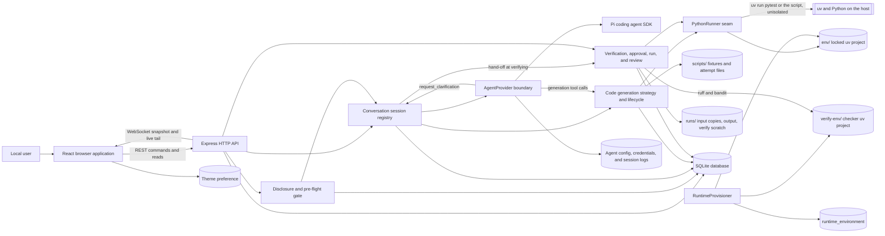
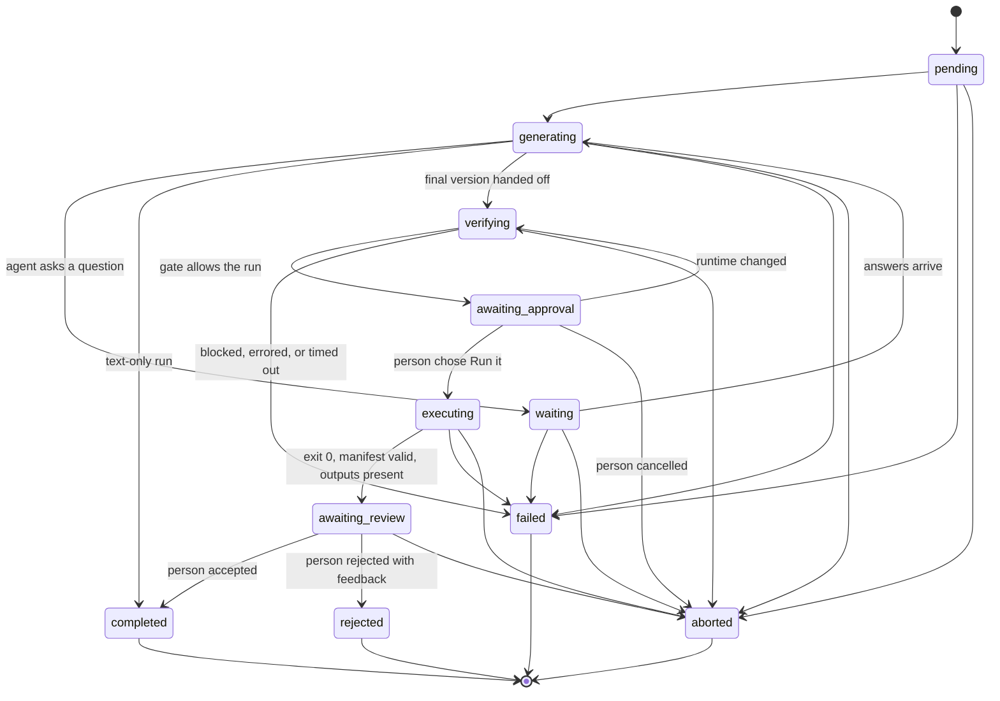
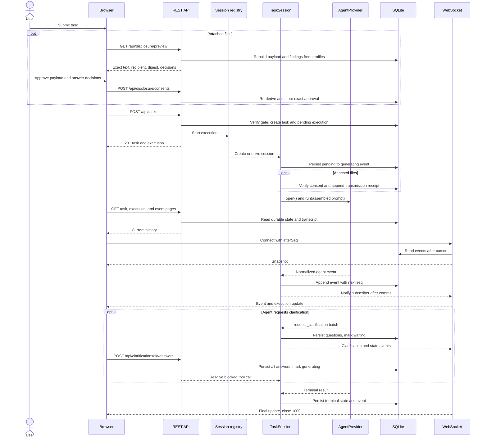
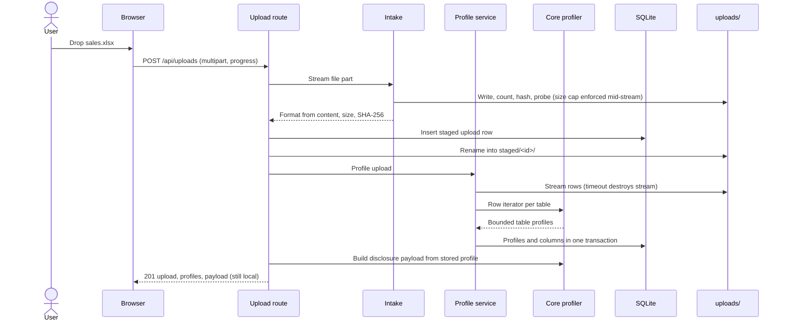
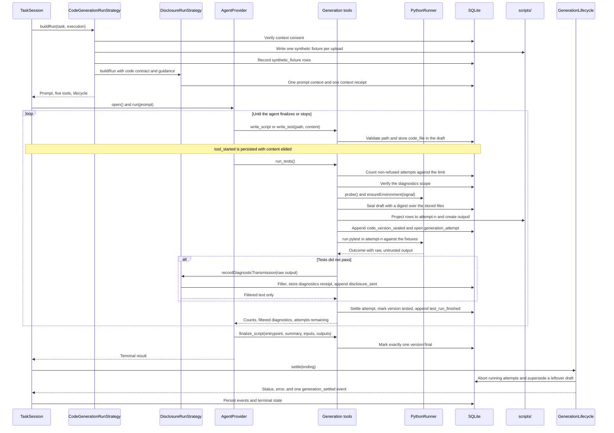
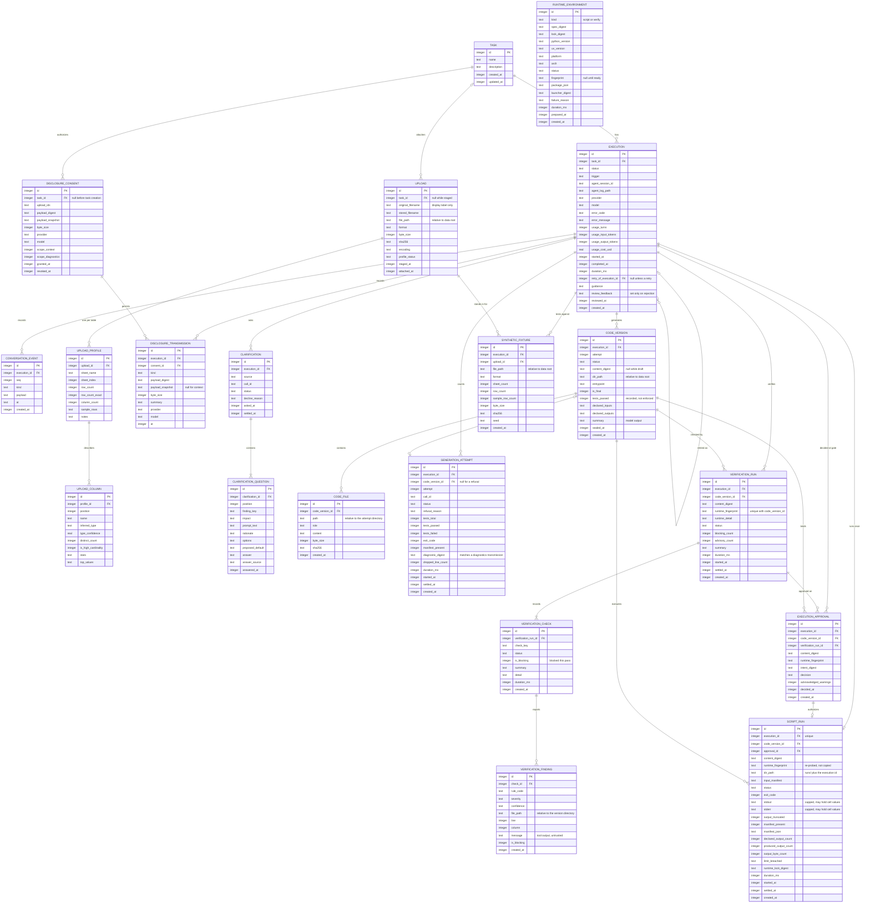

<!-- Generated by spec-lite | skill: document-design -->

# Architecture

## System Context

Auto-Mate is a single-user, local developer preview. The React shell provides task creation, task conversations, History navigation, agent Settings, theme control, and server health status. A person can enter a task, attach CSV or Excel files that are profiled locally, follow the agent conversation, and cancel the active run. The browser uses REST for commands and durable reads and a WebSocket for the server-to-client live tail. The Express server is the authority for task state, execution state, event ordering, and restart recovery.

The server reaches `@earendil-works/pi-coding-agent` only through Auto-Mate's SDK-independent `AgentProvider` contract. Provider events are normalized and sanitized before the conversation layer sees them. The application persists the transcript in SQLite before broadcasting it; the Pi session JSONL remains a local debugging artifact and is never the rendered transcript or an API response.

For a text-only task, the provider receives only the words typed into the task composer. An attached file is read, measured, and profiled locally. Before its bounded description can leave the machine, the browser shows the exact disclosure text and current provider/model, collects every required pre-flight decision, and records an explicit consent. The server binds that consent to the exact upload set, canonical payload digest, provider, and model; it verifies the binding again immediately before opening the provider session and records a transmission receipt. The agent can pause a live run through the application-owned `request_clarification` tool, and the answer becomes part of the durable transcript.

A task with attached files runs as a code-generation run (FEAT-106). The agent writes Python and pytest tests through four application-owned tools. It has no filesystem, shell, or network tool of its own. The application stores every file in SQLite and seals each candidate as an immutable version identified by a SHA-256 digest. It writes that version to `scripts/{executionId}/attempt-{n}/` and runs pytest through `uv` against synthetic fixtures built from the approved disclosure payload. The real upload is not opened during generation. Output from a failed test run goes back to the model only after the default-deny diagnostic filter, and each one is recorded as a `diagnostics` transmission.

The final version does not run on the strength of the agent's own report (FEAT-107). When generation finalizes a version, the run is handed to an application-owned verification pass. The pass makes no provider call. It re-checks the version's integrity and declared contract, lints it with `ruff`, scans it with `bandit`, and re-runs its pytest tests itself. The result is bound to the code's digest and to a fingerprint of the Python runtime. If nothing blocks, the run parks at an approval gate. There, the person sees exactly what will run, on which files, with which caveats, and has to choose **Run it** explicitly. Only then does the script run once against a verified copy of the real upload. A run that exits cleanly with every declared output parks again, until the person accepts the result or rejects it with feedback. A rejection starts a new linked execution. There is still no artifact renderer.

Generated tests and the approved script both run unisolated, with the server process's privileges, and can reach any file or host the server can. The loopback bind, request-origin checks, uv environments, the checker environment, the attempt and run directories, and the input copy organize local state. The runtime caps resource use, but none of these measures is a generated-code isolation boundary. Windows has no enforced memory cap.



## Components

The pnpm workspace has three TypeScript ESM packages with one-way dependencies from the web and server packages into the browser-safe core package.

- `@automate/core` owns TypeBox API schemas, the seventeen-member `ConversationEvent` contract, the WebSocket message union, typed errors, and the execution transition table with its `PARKED_STATUSES` and `RESTART_SURVIVING_STATUSES` sets. It also owns the pure disclosure policy: canonical serialization and digest inputs, exact disclosure rendering, consent evaluation, pre-flight ambiguity classification, the default-deny diagnostic filter, and `assemblePromptContext`, the single prompt-context construction boundary. It imports no Node or provider SDK types in the conversation boundary.
- `@automate/web` owns the React 19 shell, TanStack Router pages, TanStack Query data access, and the conversation presentation. The New task route combines the task composer and attachment intake with a blocking disclosure review that renders the literal payload, recipient, required choices, applied defaults, truncation notices, and the separate diagnostics scope. `/tasks/$taskId` renders ordered user, assistant, tool, turn, state, failure, disclosure-receipt, and clarification events; a pending clarification is answered as one batch, and a waiting banner exposes the existing abort action. `/settings` reads and updates provider/model selection and runs a live connection test, while the shell polls server health. Assistant markdown is rendered without raw HTML, while file values, clarification text, diagnostics, and tool payloads render as text. Semantic `ds.*` tokens provide styling. For a generation run, the transcript renders each `code_version_sealed` event as a collapsed code card. The card fetches file content only when opened. Each `test_run_finished` event renders its counts and a fixture note stating that the tests ran on synthetic rows and that the real file has not been read. A failed run also fetches its filtered failure text and withheld-line count. `generation_settled` renders its plain-English summary. An elided write argument renders as a size ("wrote 4.1 KiB"). While the run is active, a progress line shows the attempt count against the limit. After a failed generation run, a panel lists every attempt and offers a guidance retry. Generated code, the agent's summary, and filtered diagnostics are model-influenced text and render as text only. After a hand-off, `GateSection` on the task page shows the FEAT-107 phases. It is driven by the execution status and by counts of `verification_finished` and `run_finished` events, and it fetches its data over REST:
  - `components/verification/` renders the verification report. Each check has a blocking or advisory badge, findings are grouped by file, and a runtime note is shown. It also renders the run-intent panel with the **Run it** and cancel decision.
  - `components/execution/` renders the elapsed-time progress line while the script runs and the run result afterwards.
  - `components/review/` renders the accept or reject panel.
  - `components/runtime/` renders the two prepared environments, package details, host capabilities, and a prepare action in Settings. The conversation also renders `runtime_prepared` receipts.

  Finding messages, manifest titles, and captured run output render as text only.
- `@automate/core` also owns the pure ingestion logic (FEAT-104): format, encoding, and CSV dialect detection, cell and column type inference, the bounded single-pass column accumulator, the table profiler, and the disclosure payload builder. It is browser-safe and does no I/O; the server feeds it byte buffers and row iterators.
- `@automate/core` also owns the browser-safe generation module (FEAT-106) under `src/generation/`. It contains:
  - the provisional generation limits
  - `validateCodePath`, shared by the tool boundary and the repository so the two cannot disagree
  - `computeVersionDigest`, built on an in-module synchronous SHA-256 so the browser and server derive the same identity
  - `summarizeAttempts`, one plain-English wording for the API, the transcript, and the UI
  - `buildSyntheticFixture`
  - `renderCodeContract`, the only place the code-generation instructions exist
  - the generation REST and tool-argument schemas
  - eleven typed generation errors

  `src/execution/python-runner.ts` declares the types-only `PythonRunner` seam. `AgentToolDefinition` gained an optional `redactArgsInEvents`. None of this code imports a Node built-in.

- `@automate/core` also owns browser-safe runtime limits, readiness and capability descriptions, the three-method `PythonRunner` contract, and runtime API schemas (FEAT-108). Its verification module (FEAT-107) under `src/verification/` has no Node built-ins or I/O. It contains:
  - `decideGate`, `isBlockingFinding`, and `isBlockingCheck` in `gate-policy.ts`. This is the only place the question "may this run?" is answered.
  - the seven `CHECK_KEYS` and `summarizeVerification`, the one wording of a pass's verdict. It names counts, never rule codes or paths.
  - `computeRuntimeFingerprint`, `describeRuntimeChange`, and `describeRuntime`
  - the `RunIntent` shape, `buildIntentDigest`, and `RUN_INTENT_CAVEATS`, the only copy of the gate's three warnings
  - `evaluateApproval`, which returns the first reason an approval does not cover a run
  - `parseOutputManifest` and `reconcileOutputs`, a tolerant parser for the untrusted `manifest.json`
  - `feedbackProblem` for review feedback
  - the provisional verification and review limits; real-run limits live in `src/execution/runtime-limits.ts`

  `contracts/verification-api.ts` holds the REST schemas, and `errors/verification-errors.ts` holds eleven typed errors.

- `@automate/server` owns startup, Express routes, SQLite repositories, live sessions, transport, the Pi adapter, the ingestion pipeline, and the disclosure boundary. `DisclosureService` rebuilds previews from stored profiles and the current recipient, grants exact approvals, and verifies them again for transmission. `PreflightService` re-derives meaning-changing findings server-side. `DisclosureRunStrategy` assembles approved context, records the context receipt before the provider is opened, and registers `request_clarification`. `ClarificationService` durably records batches and answers while keeping only the live blocked promise in memory. The ingestion directory imports nothing from the agent layer and makes no network call; a test enforces both. Routes depend on repositories and the conversation or agent barrels rather than directly on provider SDK internals.
- `@automate/server` owns the generation stack (FEAT-106) in `src/generation/`. `createGenerationStack` composes it, and routes and the composition root import it only through its barrel. Its parts:
  - `CodeGenerationRunStrategy` wraps `DisclosureRunStrategy`.
  - `CodeWorkspace` owns every generated file from draft to seal to disk.
  - `FixtureService` and `fixture-writer.ts` build and write synthetic fixtures.
  - `GenerationTools` builds the four tools once and shares them across runs.
  - `GenerationRuns` holds one `GenerationRun`, a budget plus an `AbortController`, per live execution.
  - `GenerationBudget` is the single place a refusal reason is decided.
  - `GenerationLifecycle` decides how the phase ends.
  - `GenerationService` serves the read model and guidance retries to `generation-route.ts`.

  `src/execution/` holds:
  - `ProcessRunner`: an injectable spawn with `shell: false`, bounded output capture, and whole-tree kill
  - `UvPythonRunner`, which maps the unchanged three-method seam to locked uv commands
  - `RuntimeProvisioner`, which copies committed manifests, installs the pinned Python when needed, syncs both environments, and records readiness
  - `dependency-policy.ts`, the exact script and checker package sets and permitted uv argument vectors
  - `launcher-deploy.ts` and the committed Python launcher, whose digest is checked before a real run
  - `output-watchdog.ts`, which watches the run output directory during execution
  - a `FakePythonRunner` test double typed against the seam

  Generation rows are reached only through `CodeVersionRepository`, `GenerationAttemptRepository`, and `SyntheticFixtureRepository`.

- `@automate/server` owns the verification stack (FEAT-107) in `src/verification/`. `createVerificationStack` composes it, and `verification-route.ts` and the composition root import it only through its barrel. Nothing in it opens a provider session. Its parts:
  - `VerificationService` runs a pass through `runVerificationPass`, which runs the seven checks in `checks/` in order. It settles the pass through `decideGate` and moves the execution on.
  - `VerifyEnvironment` delegates locked checker preparation to `RuntimeProvisioner` and runs `ruff` and `bandit` from inside `verify-env/`.
  - `UvRuntimeProbe` produces the runtime detail and fingerprint.
  - `RunIntentService` builds the gate's intent from stored rows only.
  - `ApprovalService` records a decision at the gate.
  - `ReviewService` records a verdict on a result and seeds the feedback retry.
  - `ExecutionStateWriter` is the one place these services change an execution's status. Each move is also published as a `state_changed` event.

  `src/execution/` gained:
  - `ScriptRunService`, the minimal real-data run behind the unchanged `PythonRunner` seam
  - `input-stager.ts`, the only module that reads an upload's stored bytes, and only to copy them
  - `output-cap.ts`, the head-and-tail output cap

  The new rows are reached only through `VerificationRepository`, `ApprovalRepository`, and `ScriptRunRepository`.

`TaskSessionRegistry` enforces one live `TaskSession` per execution and the configured concurrency limit. It also tracks FEAT-107's application work as `PhaseJob`s, one per execution: a verification pass or a real-data run. A job holds a concurrency slot while it runs, is cancelled through the registry's single `abort` path, and is included in the shutdown drain. An execution in any of the `PARKED_STATUSES` (`waiting`, `awaiting_approval`, `awaiting_review`) holds no slot. Sessions in `waiting` stay live, and a separate cap bounds them. The two gate statuses have no live object at all, because the gate is a database row. The registry is also each execution's event fan-out. `subscribe` attaches a listener to the execution rather than to a session. `publish` persists an event through the live session when there is one, and otherwise appends it to the database and then broadcasts it. Events from verification, approval, the run, and the review therefore still reach an open page after the provider session has closed. A `TaskSession` opens one provider session, records session provenance, consumes normalized events, coalesces consecutive assistant deltas at 100 ms or 1 KiB boundaries, assigns the next per-execution sequence number, persists the event, and then notifies live subscribers. Before it persists a `tool_started` event, it replaces every argument key that the tool names in `redactArgsInEvents` with `{ elided: true, byteSize }`. Both write tools elide `content`, so generated code never enters `conversation_event`, while `execute()` still receives the full arguments. `DisclosureRunStrategy` sends plain user text unchanged for text-only tasks and, for attached files, sends the user request plus the approved payload snapshot and resolved pre-flight answers. It registers the clarification tool for both paths.

`RunStrategy.buildRun` may return a promise and may supply an optional `RunLifecycle`, which keeps `TaskSession` generic. The session drives the lifecycle in five ways:

- It passes the usage from every `turn_finished` event to the lifecycle, and a returned error stops the run.
- It arms a timer from the lifecycle's remaining wall clock.
- It reports every `state_changed` it records to the lifecycle's optional `onStatusChanged(to)`. On `waiting` it also disarms the timer, and on the return to `generating` it re-arms the timer with the time that remains.
- It calls the lifecycle's `cancel()` before it aborts the provider.
- It asks the lifecycle to `settle()` the terminal state once the provider run ends.

`RunSettlement.status` may also be `verifying`. That value is a hand-off, not a settlement. `GenerationLifecycle` returns it for a finalized version whenever `handOffToVerification` is set, and the composition root always sets it. The provider session is over, so `TaskSession` records usage with `ExecutionRepository.markHandedOff` and records the `generating -> verifying` event. It does not mark the execution settled. When the session's promise resolves in a non-terminal status, the registry drops the session and calls `onHandOff`, which starts `VerificationService.start` as a tracked `PhaseJob`. If verification cannot start, the execution settles `failed` instead of staying in `verifying`.

`CodeGenerationRunStrategy` is the composed default. For a text-only task, it delegates to `DisclosureRunStrategy`, and the run has no fixtures, generation tools, or lifecycle. For a task with uploads, it builds the run in six steps:

1. Verify the context consent before writing anything.
2. Create the execution's `GenerationBudget` and `GenerationRun`.
3. Write one fixture per upload.
4. Render the code contract.
5. Have the inner strategy build the run. The contract enters as application text, and retry guidance joins the person's words. This takes one `assemblePromptContext` call and records one `context` receipt.
6. Return the generation system prompt, the clarification tool plus the four generation tools, and a `GenerationLifecycle`.

The Pi adapter keeps `noTools: 'all'` and allowlists exactly the registered tools, so five tools reach the provider.

The transport boundary is intentionally split. State-changing commands use REST so they pass through correlation-ID error handling and the Origin/Host guard. The WebSocket is server-to-client application traffic only: it sends an initial snapshot, event messages, and execution summaries; inbound application frames are ignored. It subscribes to the registry, not to a `TaskSession`, and closes normally only when the execution reaches a terminal status. A page open at a gate therefore keeps its live tail. It also owns heartbeat cleanup and closes slow consumers with a retryable close code.

```mermaid
flowchart TB
  subgraph Web["@automate/web"]
    Routes[TanStack Router pages]
    Components[Composer and conversation components]
    Queries[TanStack Query and typed API client]
    Stream[REST history plus WebSocket tail]
    Routes --> Components
    Components --> Queries
    Components --> Stream
  end

  Core["@automate/core\ncontracts, schemas, errors, state machine, generation"]

  subgraph Server["@automate/server"]
    App[Express composition and middleware]
    Rest[Task and execution routes]
    GenRoute[Generation routes]
    Socket[Execution WebSocket]
    Registry[TaskSessionRegistry]
    Session[TaskSession and text coalescer]
    Strategy[CodeGenerationRunStrategy]
    Inner[DisclosureRunStrategy]
    Lifecycle[GenerationLifecycle and GenerationBudget]
    Tools[Generation tools]
    Workspace[CodeWorkspace]
    Fixtures[FixtureService]
    GenService[GenerationService]
    Runner["PythonRunner seam, UvPythonRunner"]
    Provisioner[RuntimeProvisioner]
    RuntimeRepo[RuntimeEnvironmentRepository]
    Disclosure[Disclosure and pre-flight services]
    Clarification[Clarification service]
    Repos[Task, execution, and event repositories]
    DisclosureRepos[Consent, transmission, and clarification repositories]
    GenRepos[Code version, attempt, and fixture repositories]
    Agent[AgentProvider barrel]
    Adapter[Pi adapter]
    VerRoute[Verification routes]
    VerService[VerificationService and seven checks]
    Gate["decideGate (core)"]
    Probe[UvRuntimeProbe]
    VerifyEnv[VerifyEnvironment]
    Intent[RunIntentService]
    Approval[ApprovalService]
    ScriptRun["ScriptRunService, input stager"]
    Review[ReviewService]
    StateWriter[ExecutionStateWriter]
    VerRepos[Verification, approval, and script-run repositories]
    App --> Rest
    App --> GenRoute
    App --> VerRoute
    Rest --> Registry
    GenRoute --> GenService
    GenService --> Registry
    Socket --> Registry
    Registry -. onHandOff .-> VerService
    Registry -. tracks PhaseJobs .-> ScriptRun
    VerRoute --> VerService
    VerRoute --> Intent
    VerRoute --> Approval
    VerRoute --> ScriptRun
    VerRoute --> Review
    VerService --> Gate
    VerService --> Probe
    VerService --> VerifyEnv
    VerService --> Runner
    VerService --> Workspace
    VerService --> Fixtures
    Approval --> Intent
    Approval --> Probe
    Approval --> ScriptRun
    ScriptRun --> Probe
    ScriptRun --> Runner
    Runner --> Provisioner
    VerifyEnv --> Provisioner
    Provisioner --> RuntimeRepo
    Probe --> Runner
    Review --> GenService
    VerService --> StateWriter
    Approval --> StateWriter
    ScriptRun --> StateWriter
    Review --> StateWriter
    StateWriter -->|publish| Registry
    VerService --> VerRepos
    Intent --> VerRepos
    Approval --> VerRepos
    ScriptRun --> VerRepos
    Socket --> Repos
    Registry --> Session
    Session --> Strategy
    Strategy --> Inner
    Strategy --> Fixtures
    Strategy -. builds .-> Lifecycle
    Session --> Lifecycle
    Inner --> Disclosure
    Inner --> Clarification
    Session --> Repos
    Session --> Agent
    Agent --> Adapter
    Agent -->|tool calls| Tools
    Tools --> Workspace
    Tools --> Runner
    Tools -->|raw output to filter| Inner
    Workspace --> GenRepos
    Fixtures --> GenRepos
    Lifecycle --> GenRepos
    GenService --> GenRepos
  end

  Store[(SQLite)]
  Sdk[[Pi coding agent SDK]]
  Uv[[uv, Python, and pytest]]
  Tools2[[ruff and bandit]]
  ScriptsDir[("scripts/ on disk")]
  RunsDir[("runs/ on disk")]

  Queries -->|HTTP| Rest
  Queries -->|HTTP| GenRoute
  Queries -->|HTTP| VerRoute
  VerRepos --> Store
  VerifyEnv --> Tools2
  ScriptRun --> RunsDir
  VerService --> RunsDir
  Stream -->|REST history| Rest
  Stream -->|WebSocket tail| Socket
  Web -. validates with .-> Core
  Server -. validates with .-> Core
  Repos --> Store
  Disclosure --> DisclosureRepos
  Clarification --> DisclosureRepos
  Inner --> DisclosureRepos
  DisclosureRepos --> Store
  GenRepos --> Store
  Adapter --> Sdk
  Runner --> Uv
  Workspace --> ScriptsDir
  Fixtures --> ScriptsDir
```



## Data Flow

Creating a task is an asynchronous handoff, with an additional gate when files are attached. The browser first requests `GET /api/disclosure/preview`; the server rebuilds the exact text and pre-flight findings from persisted profiles and the current provider/model. `POST /api/disclosure/consents` re-derives that preview before storing the approval. `POST /api/tasks` then independently verifies the acknowledgement and all required choices before it attaches the consent and uploads in the transaction that creates the task and first pending execution. A text-only task skips this gate. The registry starts the run without making the HTTP response wait for completion. The browser navigates to the task page, loads task/execution state and paged transcript history over REST, then opens `/api/ws/executions/:id?afterSeq=N` from the last durable sequence it holds.

During a run, the execution moves through the transition table in `packages/core/src/conversation/execution-state.ts`. An agent clarification adds the reversible `generating -> waiting -> generating` path. Code generation and its repair loop happen entirely inside `generating`. A text-only run, which has no lifecycle, still ends at `generating -> completed`. A run with uploads whose generation finalizes a version continues to `verifying`, then `awaiting_approval`, `executing`, and `awaiting_review`, and ends at `completed` or `rejected`. `completed` on that path means a person accepted the result. `awaiting_approval -> verifying` re-checks the code after the runtime changed. `completed`, `failed`, `aborted`, and `rejected` are terminal.



Each application or normalized agent event is appended to `conversation_event` before it is sent to subscribers. The WebSocket supplies a snapshot for the REST-to-socket race window and then the live tail. The browser ignores already-seen sequence numbers; if it detects a gap, receives backpressure close code `1013`, or comes back online, it reloads durable history and reconnects with its cursor.



Ingesting and profiling a file is a separate, earlier flow that involves no provider. `POST /api/uploads` streams one multipart file to `uploads/staged/`, counting, hashing, and probing the bytes in one pass and aborting the moment the size limit is passed. The first 64 KiB decide the format from content. A row is then created and the file renamed to `uploads/staged/<id>/<id>-<name>`. Next the profile service opens a streaming reader under a timeout that destroys its stream. `profileTable` in core consumes the rows once, keeping bounded aggregates and the first 10 rows, and the profiles are stored with their columns in one transaction. The upload response carries the profiles and bounded payload, but nothing is transmitted until the later review and consent flow. `POST /api/tasks` with `uploadIds` verifies and claims every upload inside the transaction that creates the task, then renames the files into `uploads/<taskId>/` after commit.



The disclosure path uses stored bytes instead of reconstructing approved context at send time. `assemblePromptContext` permits only the user request, an approved disclosure snapshot, filtered diagnostics, and application-authored text. For a task with uploads, the run makes a single call with three of those sources:

- the user request, with any retry guidance appended as the person's own words
- the consent snapshot
- application text: the resolved pre-flight answers and the code contract

Filtered diagnostics do not pass through that call. They return to the model as the result of a `run_tests` call. Their only route there is `recordDiagnosticTransmission`, which re-verifies the diagnostics scope, filters the raw output, stores the filtered text as a `diagnostics` transmission snapshot, appends a `disclosure_sent` event, and returns only the filtered text. The filter is default-deny: it keeps recognized traceback/check structure, masks quoted literals and long number runs, drops unrecognized lines, and caps the result at `AUTOMATE_MAX_DIAGNOSTIC_BYTES`.

Agent clarification batches require a rationale, a `meaning` or `data_loss` impact, and a proposed default for every question. The server counts persisted agent questions and allows at most three by default. It declines an over-budget batch, or one that would exceed waiting capacity, records the decline, and returns the proposed defaults to the agent. An accepted batch moves the execution to `waiting`; the provider tool call remains blocked until the complete answer batch arrives. The parked session is excluded from active concurrency accounting.

### Code generation and the repair loop

A generation run starts when `TaskSession` builds the run for a task with uploads. `CodeGenerationRunStrategy` verifies the context consent before any fixture is written. A revoked or stale approval therefore fails the run with nothing on disk, and the provider is never opened. The strategy then writes the fixtures, renders the code contract, and passes the contract and any retry guidance to the inner strategy's single prompt call. A fixture that cannot be built fails the run with `FIXTURE_GENERATION_FAILED` before the provider opens. After that, the application tracks the loop but does not drive it. The agent decides when to write, test, and finalize, through these tools:

| Tool                         | What the application does                                                                                                                                                                                                                                                                                                                                                                                                                     |
| ---------------------------- | --------------------------------------------------------------------------------------------------------------------------------------------------------------------------------------------------------------------------------------------------------------------------------------------------------------------------------------------------------------------------------------------------------------------------------------------- |
| `write_script`, `write_test` | Validates the path with `validateCodePath` (Python only, relative, at most two levels, no `..`, pytest naming for tests, `output/` reserved) at the tool boundary and again in the repository. Enforces `AUTOMATE_MAX_SCRIPT_BYTES`, then stores the file in the execution's single draft `code_version`, replacing any file at the same path. Returns the path, size, line count, and attempt number, but not the content.                   |
| `run_tests`                  | Takes no arguments. Runs these steps in order and stops at the first refusal: (1) return a tool error if a final version already exists, (2) claim an attempt from `GenerationBudget`, (3) verify the diagnostics scope, (4) run `probe()` and `ensureEnvironment()`, (5) seal and project the draft, (6) run pytest, (7) filter output from a run that failed, errored, or timed out, (8) settle the attempt and append `test_run_finished`. |
| `finalize_script`            | Seals an open draft that has files, or else takes the most recent sealed version. Checks that the entrypoint is a `script` file in that version and that every declared input column is a disclosed column. Then records the entrypoint, summary, and declared inputs and outputs, and marks the version final. It accepts a version whose own tests failed.                                                                                  |
| `request_clarification`      | FEAT-105's tool, unchanged.                                                                                                                                                                                                                                                                                                                                                                                                                   |

A refusal is a recorded outcome, never a thrown error. The application records a `refused` `generation_attempt` row with its reason (`attempt_limit`, `time_limit`, `cost_limit`, `diagnostics_not_granted`, or `runtime_unavailable`) and appends a `test_run_finished` event. The tool result tells the agent to finalize its best version. A refusal seals nothing and runs nothing. Because the loop depends on the diagnostics scope, declining that scope turns the first `run_tests` into a `diagnostics_not_granted` refusal instead of a silent repair.



The code path is database-first. A file lives only as a `code_file` row until `run_tests` or `finalize_script` seals its draft. Sealing reads the stored files in one transaction and computes `content_digest` as SHA-256 over the canonical JSON of `[{path, sha256}]` sorted by path. Projection then deletes and recreates `scripts/{executionId}/attempt-{n}/`, writes each file from its row through `resolveWithin`, and creates an empty `output/`. What pytest runs is written from what was digested, not from anything the agent supplied directly. Changing a sealed version's files raises `CODE_VERSION_IMMUTABLE`. The rows remain the authoritative copy, and `CodeWorkspace.project` can rewrite any sealed version from them.

`UvPythonRunner` runs pytest as `uv run --project <env> --no-sync --locked -- python -m pytest -q --tb=native -rfE -p no:cacheprovider`. The working directory is the attempt directory. `AUTOMATE_INPUT_DIR` points at the execution's fixtures, and `AUTOMATE_OUTPUT_DIR` points at the attempt's scratch `output/`. The run has a wall clock of `AUTOMATE_TEST_RUN_TIMEOUT_MS`. The child environment is the server's environment minus `AUTOMATE_*` settings (other than those two), `VIRTUAL_ENV`, and credential-shaped variables. That is hygiene, not isolation. `--no-sync --locked` prevents dependency drift during a test run. It is not a network restriction, and generated code can still reach any file or host the server process can. pytest exit code 0 maps to `passed`, 1 to `failed`, and anything else to `errored`. A timeout maps to `timed_out`, and cancellation maps to `aborted`. Output is capped per stream, keeping the head and tail, and the dropped bytes are counted. `run_tests` records whether a parseable `manifest.json` appeared, but that observation never changes the outcome.

Test output is untrusted input to the model. Generated code runs unisolated, so its stdout could carry anything the server process can read. `RunTestsExecutor.consumeRawOutput` is the only reader of raw output. It parses counts locally and, for a run that failed, errored, or timed out, sends the raw text through `recordDiagnosticTransmission`, which returns only the filtered text. `generation_attempt.diagnostic_digest` stores the SHA-256 of that filtered text, and `dropped_line_count` stores how many lines the allowlist withheld. Neither raw nor filtered output is logged.

The attempt budget is counted in the database. `GenerationBudget.claimAttempt` counts non-`refused` `generation_attempt` rows on every call, never an in-memory tally. It then checks the wall clock, measured as the time since the execution's persisted start minus the time spent in `waiting`, and spend, when `AUTOMATE_MAX_GENERATION_COST_USD` is above zero. Spend adds up only the cost the provider actually reported. During the run, `TaskSession` feeds each `turn_finished` usage to the lifecycle, which can stop the run between turns. A timer armed from the remaining wall clock can also stop it at any moment while it is generating. The wall clock pauses while the run is parked in `waiting` for a person's answer. `GenerationLifecycle.onStatusChanged` pauses the budget on `waiting` and resumes it on any other status. `TaskSession` disarms the timer while the run waits, and the budget never reports a timeout while paused. When the run returns to `generating`, the timer is re-armed with the time that was left. Either limit cancels in-flight tests before aborting the provider. Once a final version exists, limits no longer stop the run.

At the end of the run, `GenerationLifecycle.settle` marks any still-`running` attempt `aborted`. It seals a leftover draft that has files as `superseded` and discards an empty one. It then decides the terminal state, or the `verifying` hand-off, from the database, using the first matching row below, and emits exactly one `generation_settled` event with the `summarizeAttempts` text. When the settlement carries an error that the provider did not report itself, `TaskSession` also appends a `failed` event.

| Condition, checked in order                                              | Execution   | `generation_settled` outcome | Error code                                     |
| ------------------------------------------------------------------------ | ----------- | ---------------------------- | ---------------------------------------------- |
| The wall-clock timer or a spend check after a turn stopped the run       | `failed`    | `timed_out` / `cost_limit`   | `GENERATION_TIMEOUT` / `GENERATION_COST_LIMIT` |
| The person aborted, or a shutdown drain did                              | `aborted`   | `aborted`                    | none                                           |
| The provider run failed, or the session threw after the run was built    | `failed`    | `incomplete`                 | The provider's or the thrown error             |
| No attempt passed, and diagnostics were not granted                      | `failed`    | `incomplete`                 | `DISCLOSURE_SCOPE_NOT_GRANTED`                 |
| No attempt passed, and uv, Python, or the environment was unavailable    | `failed`    | `incomplete`                 | `PYTHON_RUNTIME_UNAVAILABLE`                   |
| No attempt passed, and every allowed attempt was used                    | `failed`    | `exhausted`                  | `GENERATION_ATTEMPTS_EXHAUSTED`                |
| No attempt passed, and `run_tests` was refused at the time or cost limit | `failed`    | `timed_out` / `cost_limit`   | `GENERATION_TIMEOUT` / `GENERATION_COST_LIMIT` |
| A final version exists                                                   | `verifying` | `finalized`                  | none                                           |
| Anything else                                                            | `failed`    | `incomplete`                 | `CODE_VERSION_NOT_FINAL`                       |

Exhaustion wins over finalization. A run whose attempts all failed settles `failed`, even when the agent obeyed the refusal and finalized its best version. That version stays recorded with `is_final = 1` and `tests_passed = 0`. Otherwise, a run with a final version is handed to `verifying` whether or not its own tests passed, and verification judges it independently. The lifecycle returns `completed` for that row only when `handOffToVerification` is unset, which the production composition root never leaves unset.

Generation events are receipts, not copies. `code_version_sealed` carries the version id, attempt, digest, and each file's path, role, size, and line count. `test_run_finished` carries counts, the refusal reason, the withheld-line count, attempts remaining, the limit, and whether a manifest was present. `generation_settled` carries the outcome, the final version id and digest, the attempts used, and the summary. No event carries code or diagnostic text. The browser fetches those over REST:

- `GET /api/executions/:id/code-versions` returns summaries, newest attempt first, without file content.
- `GET /api/code-versions/:id` returns every file's content and the declared contracts.
- `GET /api/executions/:id/attempts` returns each attempt, joined by digest to the filtered text of its `diagnostics` transmission, plus the `limits`.
- `GET /api/executions/:id/fixtures` returns each fixture with a preview of up to 20 rows per sheet. The preview is rebuilt from the disclosed profile and the recorded seed, not read from a file.

No response body contains an absolute path.

A guidance retry uses `POST /api/executions/:id/retry`, which sits behind the origin guard and accepts optional guidance of up to 2,000 characters. The source execution must be terminal, or the request returns `EXECUTION_NOT_RETRYABLE`. For a task with uploads, the existing consent is verified again, so a changed model or payload reopens FEAT-105's gate instead of reusing a stale approval. The prior pre-flight answers are resolved, and concurrency capacity is checked. `createRetry` then inserts a new `pending` execution with `trigger = 'rerun'`, `retry_of_execution_id`, and `guidance`. The answers are persisted after that insert commits, and the registry starts the run. The response is `201 { task, execution }`. The source run is never changed. The new run records the guidance as a second `user_prompt` event, and the guidance reaches the provider inside the `user_prompt` source.

### Verification, approval, the real run, and review

Everything after the hand-off is application work. No provider session is opened by verification, approval, the run, or the review, and nothing in these phases builds a prompt.

**One pass, bound to code and runtime.** `VerificationService.verify` first checks the execution is in `verifying` or `awaiting_approval` and has a final, sealed version. It then probes the runtime. `UvRuntimeProbe` calls `probe()` and `ensureEnvironment()`, then makes one `PythonRunner.run` of an application-authored script. The script prints the interpreter version and every installed distribution from inside `env/`. The probe adds `checker:ruff` and `checker:bandit` entries with the checker versions. The runtime fingerprint is SHA-256 over the canonical JSON of `{pythonVersion, uvVersion, platform, arch, packages}`, with packages lowercased and sorted. The probe result is memoized for rendering. Approval, the real run, and `POST /verify` ask for a fresh probe. A `verification_run` is unique on `(code_version_id, runtime_fingerprint)`:

- A `passed` or `failed` pass for an unchanged pair is reused as-is, and its verdict is applied again.
- An `aborted`, `timed_out`, or `errored` pass for the pair is discarded and redone.
- A changed runtime gets a new pass. The old pass stays, still true about the old runtime.

When a new pass is needed, the service opens a `running` row with the version's `content_digest`, the fingerprint, and the full runtime detail. It then runs the checks under one wall clock (`AUTOMATE_VERIFICATION_TIMEOUT_MS`) and one `AbortSignal` that reaches every spawn:

| Check                 | What it compares                                                                                                                                                                                                                                                                                                                                                                                              |
| --------------------- | ------------------------------------------------------------------------------------------------------------------------------------------------------------------------------------------------------------------------------------------------------------------------------------------------------------------------------------------------------------------------------------------------------------- |
| `integrity`           | Recomputes every stored file's SHA-256 and the version digest with `computeVersionDigest`. Re-derives each synthetic fixture from its recorded seed and row count into `runs/{executionId}/verify/input/` and compares its SHA-256 with the recorded one. On success, it re-projects the version's files from the database with `CodeWorkspace.project`. When integrity fails, the pass stops and every later check is recorded `skipped`. |
| `contract_entrypoint` | Checks that the entrypoint is one of the version's `script` files.                                                                                                                                                                                                                                                                                                                                            |
| `contract_inputs`     | Compares each declared input and required column with the stored upload profiles, never the upload's bytes. A missing file, sheet, or column blocks. A type difference is advisory.                                                                                                                                                                                                                           |
| `contract_outputs`    | Checks that declared outputs parse, are not empty, and are distinct plain filenames of known artifact types.                                                                                                                                                                                                                                                                                                  |
| `lint`                | Runs `ruff check --isolated --no-cache --output-format json --select E9,F,B,S <version dir>`.                                                                                                                                                                                                                                                                                                                 |
| `security`            | Runs `bandit -r -f json -q -c verify-env/bandit.yaml --ini verify-env/bandit.ini <version dir>`. A file bandit could not parse becomes a blocking `scan_error` finding.                                                                                                                                                                                                                                        |
| `tests`               | Re-runs the version's pytest tests with FEAT-106's `PYTEST_ARGS` through the `PythonRunner` seam. `AUTOMATE_INPUT_DIR` points at the rebuilt fixtures, and a scratch `verify/output/` is deleted afterwards. The check passes only for exit 0 together with a recognized pytest summary reporting zero failures. A missing summary, a collection error, zero tests, or an exit code that disagrees with the summary is `errored`. |

Both checkers run through `uv run --project verify-env --no-sync --locked` with `cwd` set to `verify-env/`, never the directory being checked. The target directory is passed as an argument. `--isolated` stops ruff from reading any configuration file. The explicit `--ini` is needed because bandit 1.9.4 reads a `.bandit` file in the target tree even when `-c` is given. With `--ini`, a file written beside the generated code cannot switch off its own checks. This is hygiene, not isolation. Tool output describes model-written code. It is stored only as normalized findings with paths relative to the version directory, at most 200 per check with blocking findings kept first, and it is never logged.

**One gate policy.** `decideGate` in core is the only place the question "may this run?" is answered. The following block:

- a failed test re-run
- a bandit finding of HIGH severity and HIGH confidence
- a ruff rule with the prefix `E9`, `F6`, `F7`, or `F82`, or the exact code `invalid-syntax`, which is how current ruff reports a syntax error
- a failed integrity, entrypoint, or declared-output check
- a missing required file, sheet, or column

A blocking check that `errored` also blocks, because a check that could not run is not a check that passed. A missing check key blocks too. Everything else is advisory. Each finding's `is_blocking` is resolved through the same policy when it is created. `verification_check.is_blocking` stores whether that check blocked this pass. Both are written in the transaction that settles the pass, so a later policy change never rewrites why a run was allowed.

The pass settles `passed` or `failed`, or `aborted`, `timed_out`, or `errored` when it was cut short or threw. `summarizeVerification` words the verdict, and the service appends one `verification_finished` event. A `passed` pass moves the execution `verifying -> awaiting_approval`. An `aborted` pass settles the execution `aborted`. Any other pass settles it `failed` with `VERIFICATION_BLOCKED` and the plain-English verdict. A blocked run is a recorded outcome, not an error, and it is retried through FEAT-106's guidance retry. A missing runtime found by the probe settles a handed-off run `failed`, with a `failed` event.

**The approval gate.** `GET /api/executions/:id/intent` returns a `RunIntent` and its `intentDigest`. `RunIntentService` builds the intent from stored rows only, with no probe, clock, or filesystem read. It contains:

- the version: short digest, file and line counts, and entrypoint
- the agent's summary
- each input, named by its original filename, size, short SHA-256, and sheets
- the declared outputs
- each check with its badge, the verdict, and the counts
- the test totals and fixture row count
- the runtime and its package list
- the three `RUN_INTENT_CAVEATS`, verbatim

`POST /api/executions/:id/approval` carries the digest the page was shown. `ApprovalService.decide` checks the following, in order:

1. The execution must be `awaiting_approval`, or the request fails with `EXECUTION_NOT_APPROVED`.
2. The intent is rebuilt, and its digest must equal the one sent, or the request fails with `APPROVAL_INTENT_MISMATCH`.
3. A `cancelled` decision is recorded, and the execution becomes `aborted`.
4. For an approval, the runtime is probed fresh. If the fingerprint differs from the verified one, nothing is recorded. The execution moves back to `verifying`, a new pass starts, and the response is `reverify` with `describeRuntimeChange` sentences that name the changed interpreter or package.
5. Advisory findings must have been acknowledged.
6. Concurrency capacity must be free.

`ApprovalRepository.decide` then inserts the `execution_approval` row and moves the execution to `executing` in one transaction. The row binds the content digest, the runtime fingerprint, and the intent digest. An `approval_decided` event follows, and the real run starts as a tracked `PhaseJob`.

**The real run.** `ScriptRunService` works in this order, and nothing is spawned until the gate has passed:

1. `stageInputs` copies each attached upload to `runs/{executionId}/input/<stored_filename>` and re-digests the copy against `upload.sha256`. A mismatch raises `INPUT_COPY_MISMATCH`. The file is named by its position, never by its name.
2. It recreates an empty `runs/{executionId}/output/`.
3. It recomputes the content digest from the stored files and probes the runtime fresh.
4. `ScriptRunRepository.openGated` opens the `script_run` row. Inside one transaction, it reads the `approved` approval and compares the digest, the fingerprint, and the code version with it. A stale approval throws `APPROVAL_STALE` and writes nothing. The execution then settles `failed` with a `failed` event, and no process is started.
5. The version is re-projected, and the runner runs `python <entrypoint>` in the attempt directory. `AUTOMATE_INPUT_DIR` points at the input copies, `AUTOMATE_OUTPUT_DIR` points at `output/`, and the wall clock is `AUTOMATE_SCRIPT_RUN_TIMEOUT_MS`.

Stdout and stderr are each capped head-and-tail at `AUTOMATE_MAX_RUN_OUTPUT_BYTES` (1 MiB by default). They are stored in `script_run` and never logged, because they can contain the person's cell values. The runner's capture limit is raised to at least twice that value. `manifest.json` is untrusted, and `parseOutputManifest` parses it. It is reconciled with the files actually present. A run that exits 0 with a valid manifest and every declared file present settles `succeeded`, and the execution moves to `awaiting_review`. Other endings settle `script_run` as `failed`, `errored`, `timed_out`, or `aborted`. An aborted run settles the execution `aborted`. Any other failure settles it `failed` with `RUN_OUTPUT_MISSING` and a sentence saying what happened. Every ending appends one `run_finished` event.

**Review.** `POST /api/executions/:id/review` accepts `accepted` or `rejected`. Acceptance moves `awaiting_review -> completed`. Rejection requires non-blank feedback of at most 2,000 characters. It stores the feedback on the execution, settles it `rejected`, and seeds a new execution through FEAT-106's `GenerationService.retry` with `trigger = 'feedback'`. The feedback becomes that execution's guidance. The verdict is recorded before the retry is attempted. A retry refused at the concurrency cap therefore returns its error without rolling the rejection back. A `review_decided` event carries the verdict and the retry's id.

The FEAT-107 routes are:

- `GET /api/executions/:id/verification`: the latest pass with checks in policy order and findings.
- `POST /api/executions/:id/verify`: returns `202`, checks capacity, and starts a pass with a fresh probe. It is allowed from `verifying` or `awaiting_approval`.
- `GET /api/executions/:id/intent`: the intent and its digest.
- `POST /api/executions/:id/approval`: the gate decision.
- `GET /api/executions/:id/run`: the run, with outputs named by filename only.
- `POST /api/executions/:id/review`: the review verdict.

The three `POST` routes sit behind the Origin/Host guard. No response contains an absolute path.

```mermaid
sequenceDiagram
  participant S as TaskSession
  participant G as Session registry
  participant V as VerificationService
  participant P as UvRuntimeProbe
  participant C as ruff and bandit (verify-env)
  participant R as PythonRunner
  actor U as Person
  participant A as ApprovalService
  participant X as ScriptRunService
  participant W as ReviewService
  participant D as SQLite

  S->>D: markHandedOff (generating to verifying)
  S-->>G: Session resolves in verifying
  G->>V: onHandOff, start as PhaseJob
  V->>P: probe()
  P->>R: ensure locked env, run probe script
  V->>D: Reuse the pass for (version, fingerprint), or open a new one
  V->>D: Integrity: file digests, version digest, fixtures rebuilt from seed
  V->>V: Contract checks against stored profiles
  V->>C: ruff and bandit, cwd verify-env
  V->>R: pytest re-run against the rebuilt fixtures
  V->>V: decideGate
  V->>D: Settle pass, checks, and findings, append verification_finished
  alt Allowed
    V->>D: verifying to awaiting_approval
    U->>A: POST approval (intentDigest, Run it)
    A->>A: Rebuild intent, compare digest
    A->>P: probe(fresh)
    alt Runtime changed
      A->>D: awaiting_approval to verifying
      A->>V: start a new pass
      A-->>U: reverify with the concrete changes
    else Same runtime
      A->>D: Insert approval and move to executing in one transaction
      A->>X: start as PhaseJob
      X->>X: Copy uploads to runs/id/input and verify SHA-256
      X->>P: probe(fresh)
      X->>D: openGated compares digest and fingerprint with the approval
      X->>R: digest-checked launcher runs Python entrypoint
      Note over R: POSIX RLIMIT_AS and RLIMIT_FSIZE; output watchdog on every platform
      X->>D: Store capped output, settle script_run, append run_finished
      X->>D: executing to awaiting_review
      U->>W: POST review
      W->>D: accepted to completed, or rejected plus a feedback retry
    end
  else Blocked
    V->>D: verifying to failed (VERIFICATION_BLOCKED)
  end
```

Cancellation uses `POST /api/executions/:id/abort`. The registry cancels a pending clarification first, then asks the live session to abort. `TaskSession.abort()` calls the lifecycle's `cancel()` before the provider's `abort()`. For a generation run, `cancel()` aborts the run's single `AbortController`. Every `ensureEnvironment` and `run` call receives that controller's signal. So the order is: pending clarification, then an in-flight `uv python install`/`uv sync --locked` or pytest, then the provider session. A cancelled or timed-out process has its whole process tree killed: `taskkill /T /F` on Windows, and a signal to the process group elsewhere. A pytest cut short settles its attempt `aborted`. Shutdown draining and a lifecycle limit follow the same cancel-then-abort order, and there is no second cancel path. The same `abort` route covers the FEAT-107 phases:

- With no live session but a tracked `PhaseJob`, the registry calls the job's `abort()`, which aborts its `AbortController`, and waits for it to settle. A verification pass then kills its in-flight `ruff`, `bandit`, or pytest tree and settles the pass `aborted`. A real run kills the script's tree and settles `script_run` `aborted` with `limit_breached` null. Either way the execution ends `aborted`. A limit kill is stored differently: `timed_out` with `time`, or `failed` with `memory`, `output_bytes`, or `output_files`, and the execution fails with `SCRIPT_LIMIT_EXCEEDED`. So an abort and a limit kill can be told apart in storage.
- Runtime preparation (FEAT-108) sits on the same path. `RuntimeProvisioner.ensureRuntime` keeps one in-flight preparation per environment kind and counts its waiters. An aborting caller detaches while other waiters remain. Only the last waiter's abort cancels the preparation, kills the `uv python install` or `uv sync --locked` process tree, and settles the `runtime_environment` row `aborted`. The run leg awaits preparation before `openGated`, so an abort during preparation writes no `script_run` row and starts no script.
- An execution parked in `awaiting_approval` or `awaiting_review` has no process to stop, so the registry settles it straight to `aborted` and publishes the `state_changed` event.

A terminal execution returns `EXECUTION_NOT_RUNNING`. A non-terminal database row with no live session, no job, and no gate returns `EXECUTION_INTERRUPTED`.

`packages/server/src/__tests__/cancellation-matrix.test.ts` checks this as one table over ten legs, from provider generation through interpreter install, environment sync, and the real run. Each leg must end with the execution and the leg's row `aborted`, every fake process tree killed, concurrent aborts idempotent, and a further abort refused. Separate cases cover shared-preparation detach, limit kill versus abort, and shutdown draining.

Recovery has explicit outcomes:

| Event                       | Implemented outcome                                                                                                                                                                                                                                                                                                                                                                                                                                 |
| --------------------------- | --------------------------------------------------------------------------------------------------------------------------------------------------------------------------------------------------------------------------------------------------------------------------------------------------------------------------------------------------------------------------------------------------------------------------------------------------- |
| Browser disconnect          | The server-side run continues. Reconnection replays events after the browser's last sequence and resumes the live tail.                                                                                                                                                                                                                                                                                                                             |
| Server restart during a run | Before listening, startup handles every active execution: `pending`, `generating`, `waiting`, `verifying`, and `executing`. For each one, it first settles any generation attempt, `verification_run`, or `script_run` still `running` as `aborted`. It then marks the execution `failed` with `EXECUTION_INTERRUPTED`, interrupts any pending clarification, and appends a final `state_changed` event. `waiting` is interrupted because its question lives in a live provider session. This follows the FEAT-105/FEAT-110 resolution recorded in `TODO.md`, not the wording of FEAT-107's TASK-004. `awaiting_approval` and `awaiting_review` are left untouched: they hold no in-memory state, and the person's pending decision survives the restart. Provider sessions, in-memory waits, verification passes, and runs are not resumed. Sealed code versions, attempts, fixtures, passes, approvals, and runs stay readable, and a guidance retry starts a new execution. |
| Graceful shutdown           | The registry cancels clarification waits, asks every live session to abort, and aborts every `PhaseJob`. This stops in-flight `uv`, pytest, checker, and script process trees before the provider. It waits up to five seconds for sessions and jobs. It then marks any still-active row interrupted, with its `running` attempts, passes, and runs settled `aborted`, before closing sockets and SQLite. Rows parked at a gate are left as they are.                                                                                   |
| Slow or half-open socket    | Backpressure closes with `1013` so the browser reloads history; heartbeat terminates a connection after two missed pong intervals.                                                                                                                                                                                                                                                                                                                  |
| Multiple browser clients    | Each client receives the same persisted sequence; disconnecting one subscription does not stop the execution or other clients.                                                                                                                                                                                                                                                                                                                      |

## Data Model

SQLite is the durable source for application metadata, task definitions, execution summaries, the displayed conversation, generated code, verification results, approvals, runs, and prepared Python environments. Drizzle defines the schema and the server applies committed migrations in-process. The connection enables WAL and foreign-key enforcement. There are seven committed migrations, named by timestamp. The fifth, `20260925044250_damp_otto_octavius` (FEAT-106), does three things:

- It creates the four generation tables.
- It adds the two new `execution` columns with `ALTER TABLE ... ADD`.
- It rebuilds `conversation_event` to widen its `kind` CHECK, copying every row and recreating the unique `(execution_id, seq)` index.

The sixth, migration 0005 in `drizzle/20260925161513_equal_synch/` (FEAT-107), makes these changes:

- It creates `verification_run`, `verification_check`, `verification_finding`, `execution_approval`, and `script_run`.
- It adds `execution.review_feedback` and `execution.reviewed_at`.
- It rebuilds `conversation_event` to allow the four new event kinds.
- It rebuilds `execution` to widen the status CHECK to all eleven statuses and the trigger CHECK to `manual`, `rerun`, and `feedback`. The rebuild splits the partial status index into `execution_active` and `execution_parked`.
- It ends with a hand-added guard. A CHECK on a temporary table fails the statement when `pragma_foreign_key_check` finds any orphaned row, so the whole migration rolls back instead of committing a broken graph.

The seventh, `20260925194955_safe_blackheart` (FEAT-108), adds `runtime_environment`, records output usage, limit breaches, and the runtime lock digest on `script_run`, and extends `conversation_event` with `runtime_prepared`. The runtime table has one row per environment kind, spec digest, lock digest, platform, and architecture. It has no task foreign key: preparation history survives task deletion.

`migrateDatabase` turns foreign keys off before drizzle's `BEGIN` and back on afterwards, even on failure. This matters because drizzle wraps every pending migration in one transaction, and inside a transaction SQLite ignores `PRAGMA foreign_keys`. With foreign keys still on, `DROP TABLE execution` would fire every `ON DELETE CASCADE` and empty every child table. A migration test demonstrates that failure.



- `task` stores the trimmed plain-language request and a deterministic display name derived from its first useful line.
- `execution` owns the state machine, provider/model provenance, optional sanitized failure, optional usage, and timings. Its `agent_log_path` is persisted for local diagnostics but excluded from browser contracts.
- `conversation_event` is the append-only transcript. `(execution_id, seq)` is unique and indexed; `seq` is the replay cursor and browser deduplication key. `payload` stores the complete JSON event, while `kind` and `at` support integrity and inspection.
- Deleting a task cascades to its executions and events. `execution(task_id)` supports task history, and a partial index over active statuses supports restart reconciliation.
- `upload`, `upload_profile`, and `upload_column` (FEAT-104) describe input files. Columns are rows rather than JSON so a later re-run can compare inputs by query. A `CHECK` constraint makes the D04 rule a data fact: a high-cardinality column holds no distinct count and no frequent values. `(upload_id, sheet_index)` and `(profile_id, position)` are unique. A partial index over unattached uploads serves the orphan sweep. Deleting a task cascades through all three tables, and the sweeper removes the task's upload folder, because cascades do not touch files.
- `disclosure_consent` is an immutable approval of one sorted upload set, exact payload snapshot and digest, recipient, and context/diagnostic scopes. It starts with a null `task_id` because approval precedes task creation, then is attached inside the task transaction. Revocation is represented without deleting the audit record.
- `disclosure_transmission` is the append-only receipt linked to both execution and consent. A context row stores the approved digest but reuses the consent snapshot; a diagnostics row stores its filtered snapshot. Checks constrain kinds and snapshot nullability, while the repository transaction independently rejects a revoked consent, recipient mismatch, or context-digest mismatch.
- `clarification` stores either an answered pre-flight batch or an agent batch with pending, answered, declined, cancelled, or interrupted status. `clarification_question` preserves order, impact, rationale, options, proposed default, answer, and answer source. Schema checks exclude cosmetic impact and constrain answer provenance to user, default, or seeded.
- `code_version` (FEAT-106) is one candidate per attempt. `draft` is its only mutable status and has no digest. A CHECK makes "draft, no digest, no seal time" a single fact rather than three fields that could disagree. The sealed statuses are `sealed`, `tested_pass`, `tested_fail`, and `superseded`, which marks a leftover draft frozen when the run settles. `(execution_id, attempt)` is unique. Partial unique indexes allow at most one draft and at most one final version per execution, and `content_digest` is indexed for lookup by identity. `tests_passed` is recorded, not enforced. `dir_path` is relative, so `AUTOMATE_HOME` can move without rewriting rows.
- `code_file` holds the only authoritative copy of generated code. `(code_version_id, path)` is unique, and a CHECK limits `role` to `script`, `test`, or `support`. The repository re-validates each path and refuses to add, replace, or seal files of a version that is no longer a draft. The files under `scripts/` are projections of these rows.
- `generation_attempt` records one `run_tests` call, and it is the attempt limit: the budget counts its non-`refused` rows on every claim. `(execution_id, attempt)` is unique. `code_version_id` and `call_id` are unique where they are present, so there is one test run per sealed version and one attempt per tool call. A CHECK ties `status = 'refused'` to a non-null `refusal_reason`. The filtered diagnostic text is not stored here. `diagnostic_digest` matches the `payload_digest` of the `diagnostics` transmission that holds it, deliberately without a foreign key, because an attempt that passed sends nothing.
- `synthetic_fixture` records one fixture per upload per execution, with `(execution_id, upload_id)` unique. It stores the relative file path, which is named after the upload's `stored_filename`, plus the format, sheet and row counts, how many rows are verbatim sample rows, the byte size, the SHA-256, and the seed. The seed is derived from the upload's SHA-256 and the execution id, so the same run always rebuilds identical fixture data.
- `execution.retry_of_execution_id` links a retry to its source with `ON DELETE SET NULL`, so deleting a failed run never deletes its replacement. `execution.guidance` holds the person's hint. A guidance retry's `trigger` is `rerun`. A retry seeded by a rejected result has `trigger = 'feedback'`, and its guidance is the feedback. A partial index serves the retry link.
- `execution.review_feedback` and `execution.reviewed_at` (FEAT-107) record a person's verdict. Feedback is stored only for a rejection. The partial index `execution_active` covers the statuses a restart interrupts. `execution_parked` covers `awaiting_approval` and `awaiting_review`.
- `verification_run` (FEAT-107) is one pass over one sealed version on one runtime. It stores the version's `content_digest`, the `runtime_fingerprint`, and the full `runtime_detail` JSON the fingerprint was computed from. `(code_version_id, runtime_fingerprint)` is unique, which is what makes a pass reusable for an unchanged pair. `VerificationRepository.discardInconclusive` removes an `aborted`, `timed_out`, or `errored` row so the pair can be verified again. CHECKs constrain the status, keep the counts non-negative, and tie `running` to a null `settled_at`.
- `verification_check` holds exactly one row per check key per pass, with `(verification_run_id, check_key)` unique. A CHECK limits the key to the seven `CHECK_KEYS`. Checks that never ran are written as `skipped`, so a settled pass always has all seven. `is_blocking` records whether that check blocked this pass. `detail` is check-specific JSON, such as test counts, the fixture digests, or a short head-and-tail output excerpt.
- `verification_finding` stores one normalized finding with a version-relative path and the policy's `is_blocking`, resolved when the finding was created. A partial index serves blocking findings. Finding messages are tool output about model-written code.
- `execution_approval` records a decision at the gate. It binds the content digest, the runtime fingerprint, and the intent digest, and links the verification run and code version it was shown. A partial unique index allows at most one `approved` row per execution. `cancelled` rows are kept as history.
- `script_run` is the one real-data run per execution, with `execution_id` unique. `ScriptRunRepository.openGated` is the only way a row is created. The row records the approval it ran under, the digest recomputed from the stored files, the freshly probed fingerprint, the relative run directory, and an input manifest with each staged copy's upload id, stored name, SHA-256, and size. When it settles, it records the exit code, the capped `stdout` and `stderr`, whether anything was cut, and the manifest as written, when it was valid. It also records the declared and produced output counts. `stdout` and `stderr` can contain the person's cell values. They are stored here and never logged.
- `runtime_environment` (FEAT-108) stores one preparation state per environment kind and exact manifest and host shape. `preparing`, `ready`, `failed`, and `aborted` are constrained states; only a ready row has a fingerprint and package list. Its unique scope index prevents duplicate preparations, while fingerprint and ready indexes serve lookup. The script launcher digest records the bytes deployed beside the script environment. There is no foreign key from a run to this table; the run retains its own fingerprint and lock digest even if an environment is later prepared again.
- `script_run.output_byte_count`, `limit_breached`, and `runtime_lock_digest` record the observed output, the stopping limit, and the exact dependency lock. A time breach requires `timed_out`; memory and output breaches settle as failures.

- Deleting an execution cascades to its code versions, files, attempts, fixtures, verification passes, checks, findings, approvals, and run. Deleting an upload cascades to its fixtures. Nothing deletes `scripts/{executionId}/` or `runs/{executionId}/` from disk yet, and none of these rows has a retention policy.
- `app_meta` remains the key/value store for schema version, application version, and installation time. Drizzle also maintains its migration table.

The broader `.spec-lite/data_model.md` remains a proposal and includes deferred tables that are not present. There are currently no artifact, schedule, template, or tool-registry tables.

## Key Design Decisions

- **Shared application contracts:** TypeBox schemas, browser-safe types, and typed errors live in `@automate/core`, so the browser and server validate the same health, agent, task, execution, event, and error shapes.
- **One agent seam and one SDK adapter:** Application code consumes `AgentProvider.open(options)` and normalized events. Pi session construction and model lookup stay under `packages/server/src/agent/adapters/pi/`; ambient Pi settings, prompts, skills, and extensions are not loaded into an Auto-Mate session.
- **Application-owned configuration:** Provider/model selection lives in `config/agent.json`; managed credentials live under `pi/`, or the user can opt into a personal Pi credential file. Credential values are not returned by APIs, rendered, or logged.
- **Explicit local storage boundary:** `AUTOMATE_HOME` overrides `~/.automate/`. OS-aware path construction and `resolveWithin` keep execution session directories beneath `agent-sessions/`, generated files and fixtures beneath `scripts/`, and input copies, run output, and verification scratch beneath `runs/`. SQLite uses `node:sqlite` behind Drizzle with WAL and foreign keys.
- **Correlated API errors:** Middleware accepts a bounded inbound correlation ID or creates one, and one error handler returns the stable public envelope while hiding unexpected internal details.
- **Application-owned React conversation UI:** FEAT-103 does not adopt `@earendil-works/pi-web-ui`. React components render Auto-Mate's normalized event contract directly, avoiding a second browser-side Pi stack and keeping SDK types behind the server adapter.
- **Server-owned replayable state:** SQLite, not the browser or raw Pi JSONL, is authoritative. A single live writer assigns a monotonic per-execution `seq`, and the database uniqueness constraint catches violations.
- **Persist before broadcast:** A client never receives a conversation event that cannot subsequently be replayed from the database.
- **REST commands, WebSocket progress:** Commands retain correlation IDs, validation, and the common error envelope. The socket is a resumable, server-to-client tail rather than a second command API.
- **Explicit restart semantics:** In-memory provider sessions, verification passes, and runs are not reconstructible. Startup therefore converts active rows, including `waiting`, to a readable interrupted failure instead of leaving stale state or pretending to resume. The two gates, `awaiting_approval` and `awaiting_review`, are database rows with nothing in memory, so they survive a restart and wait for the person.
- **Origin and Host validation:** State-changing REST routes and WebSocket upgrades accept the local application origins plus explicitly configured origins. Missing Origin is allowed for non-browser clients; an unrecognized or `null` Origin is rejected. This mitigates browser cross-site requests and DNS rebinding against the loopback service, but it is not authentication or code isolation.
- **Local profiling, bounded disclosure (D04):** Ingestion runs in Node, not Python, so it works before any Python runtime exists. What may ever leave the machine is one bounded artifact: at most 10 sample rows with 200-character cells, frequent values only for columns under 1,000 distinct values, and 64 KiB in total, degraded in a fixed, recorded order. The bound is enforced in the accumulator, the repository, the payload builder, and the schema.
- **Exact, recipient-bound approval:** The preview digest covers the rendered disclosure text, sorted upload ids, provider, and model. Consent is checked once before task creation and again before prompt construction. The provider receives the approved snapshot rather than a re-rendered payload, and a receipt is inserted before the session is opened.
- **One prompt-context chokepoint:** `assemblePromptContext` admits only user text, approved disclosure bytes, filtered diagnostics, and application-authored context. Pi adapter details and arbitrary provider output cannot be injected as file context through this boundary. Code generation widens nothing. The strategy wraps FEAT-105's rather than replacing it, the code contract enters as application text, retry guidance enters as the person's words, and all of it goes through the same single call.
- **Default-deny diagnostics:** Repair support can retain only recognized traceback frames, exception types, static-analysis findings, and test-failure structure. Literals and long number runs are masked, unknown lines are counted and dropped, and the filtered text requires the separately granted diagnostics scope. The repair loop is its caller: every byte of pytest output that reaches the model passes through `recordDiagnosticTransmission`, and the withheld-line count is shown rather than hidden.
- **Questions are structural, bounded, and durable:** Pre-flight classification asks only about meaning or data-loss ambiguity and caps the blocking screen at three required findings, demoting the remainder to disclosed defaults. Agent questions use one typed custom tool, require rationale and a proposed default, and are counted from persisted rows. The default cap is three questions per execution.
- **Waiting is parked, not terminal:** An accepted agent question moves `generating` to `waiting` while its tool call remains open. Waiting sessions do not consume the active concurrency limit but are bounded separately. The FEAT-107 gates, `awaiting_approval` and `awaiting_review`, are parked the same way, so a run left at a gate never blocks another task. Verification passes and real runs do hold a slot while they run. Answers restore `generating`; abort, shutdown, or restart settles the wait explicitly instead of leaving an orphaned pending row. A generation run's wall clock pauses while it waits, so the time a person takes to answer does not count against `AUTOMATE_GENERATION_TIMEOUT_MS`. The tradeoff is that a parked run has no deadline until it resumes.
- **The application tracks the repair loop but does not drive it (D07):** The agent decides when to write, test, and finalize. The application enforces what matters at its tool boundaries: path rules, size caps, the attempt count, the consent scope, and the runtime check. Attempts are visible in the transcript and never park to ask permission to try again. `finalize_script` records whether the final version's tests passed but does not refuse a failing one, because authorizing execution belongs to FEAT-107's verification. A generation phase that ends with a final version therefore means "a candidate exists", not "the code works".
- **Database-first, digest-identified code:** The agent can only hand code in as tool arguments. The file lands in `code_file`, the digest is computed from the stored rows, and the disk projection is written from those same rows after sealing. "Which exact code was tested" is answered by a digest over the stored rows, not by the order writes happened in. The cost is a second copy on disk, which is rebuildable from the rows.
- **The attempt limit is a database count (D14):** `AUTOMATE_MAX_GENERATION_ATTEMPTS` (default `3`, provisional) is enforced by counting `generation_attempt` rows at the tool boundary, not by an instruction in the prompt. A model that ignores its instructions still cannot take another turn, and no in-memory tally exists for a restart to reset. A refusal is a recorded outcome the loop ends on, not an error.
- **Synthetic fixtures only (D04):** The agent's tests run against data rebuilt from the approved payload's disclosed tables: the header, the approved sample rows verbatim, and invented rows drawn from disclosed statistics. Only low-cardinality columns reuse their disclosed frequent values. `buildSyntheticFixture` takes a profile or disclosed table, never a path, and `FixtureService` has no reference to an upload's stored location. The fixture keeps the real file's stored name, format, CSV dialect, encoding, and sheet order, so a script finds its input the same way later. The accepted cost is that code can pass on synthetic rows and still fail on the real file, and the UI says so.
- **Test output is untrusted input to the model (D03/D04):** Generated tests run unisolated, so their output could carry anything the server process can read. Raw output has one reader, which sends it to the model only through the default-deny filter, as a recorded `diagnostics` transmission. The repair loop is gated on the diagnostics scope, so declining that scope stops the loop instead of repairing on data the person did not agree to send.
- **Transcript receipts, not copies:** The three generation events carry ids, digests, sizes, and counts. Code, filtered diagnostics, and fixture previews are fetched over REST on demand. Tool-argument elision keeps generated code out of `conversation_event`, so there is one copy of every file and reconnect replay stays small.
- **Generic session, strategy-owned lifecycle:** `TaskSession` does not know about generation. A strategy may hand it a `RunLifecycle` for usage, the deadline, cancellation, and settlement. Generation policy stays in one module, and a text-only run is unchanged.
- **A narrow Python seam with a locked implementation (D05):** `PythonRunner` still has exactly three methods, `probe`, `ensureEnvironment`, and `run`, in browser-safe core. `UvPythonRunner` implements them with exact, application-owned uv command vectors. The eight script packages and two checker packages have exact versions in `dependency-policy.ts` and committed manifests. `pnpm runtime:lock` updates the repository locks; application runtime never resolves dependencies. Test and real runs use `uv run --no-sync --locked`, and preparation uses `uv sync --locked`. This prevents dependency drift but does not restrict file or network access.
- **Preparation is shared and recorded:** `RuntimeProvisioner` copies each committed `pyproject.toml`, `uv.lock`, and `.python-version` into the data root, installs pinned CPython 3.14.6 through uv when absent, synchronizes the environment, inspects installed packages, and stores a `runtime_environment` row. It coalesces concurrent callers per environment kind; cancelling one waiter leaves preparation running for the others. Readiness checks manifest digests and the script launcher's digest. A changed lock creates a new scope, preserving earlier runtime provenance. The script launcher is checked again immediately before a real run.
- **Resource caps are explicit and platform-dependent (D14):** Every real run has a wall clock, bounded captured stdout and stderr, and a polling watchdog for output file size, total bytes, and file count. The process runner kills the process tree on timeout, cancellation, or a watchdog breach. On macOS and Linux, the absolute-path Python launcher sets equal soft and hard `RLIMIT_AS` and `RLIMIT_FSIZE` before executing generated code. It uses `PYTHONSAFEPATH=1` so generated code cannot replace the launcher through working-directory module lookup. Windows has no enforced memory cap. These are resource limits and launcher hygiene, not a sandbox.

- **Unisolated test execution (D03):** Generated tests run with the server process's privileges and can reach any file or host it can. The uv environment, the attempt directory, the withheld environment variables, and the fixture substitution are hygiene and are not a security boundary. What is true is narrower. The agent itself has no file, shell, or network tool. Its tests are pointed at synthetic data, so code that reads its input the way the contract says never opens the person's file during generation. Nothing prevents generated code from opening other paths.
- **Retry is a new execution:** A guidance retry, or the retry a rejected result seeds, inserts a linked execution rather than mutating the source, so history keeps both. It reuses the consent only after re-verifying it, and it seeds the prior pre-flight answers.
- **The agent's report is not the verdict (FEAT-107):** Verification re-runs the tests itself instead of trusting `generation_attempt.tests_passed`. It uses fixtures it rebuilt and proved byte-identical to the recorded ones. It also adds the checks only the application can make: the digest, the entrypoint, the declared outputs, and the columns in the person's actual file profile. The pass sends nothing to a model. The cost is running the tests a second time.
- **One gate policy, stored with the result (D14):** `decideGate` is the single place that decides whether code may run. Blocking is reserved for code that is broken or dangerous. Untidy code is advisory. A check that could not run blocks. The ruff prefixes, the bandit HIGH/HIGH threshold, and the limits are provisional against D14. Each finding's `is_blocking` and each check's `is_blocking` are written with the pass, so changing the policy later does not rewrite history.
- **A verification is bound to code and runtime:** A pass is a fact about one `(code_version_id, runtime_fingerprint)` pair. It is reused for that pair and never silently re-derived. A new Python, uv, platform, package, or checker version moves the fingerprint, and the code is checked again before it can run. `describeRuntimeChange` names the concrete change instead of showing a hash. The probe reads packages from inside `env/` through the existing `PythonRunner.run`, so the seam stays at three methods. Inconclusive passes are discarded and redone rather than reused.
- **Approval covers exactly what was shown:** The intent is rebuilt from stored rows. The page must send the digest of the intent it rendered, the same mechanism FEAT-105 uses for a disclosure payload. The approval row binds the code digest, the runtime fingerprint, and the intent digest. The row and the state change are one transaction. The run re-checks the approval as a database operation: `openGated` compares the digest, recomputed from stored files, and a freshly probed fingerprint with the stored approval before any process exists. A stale approval therefore produces zero processes.
- **Running is not succeeding (D07):** Process exit is not acceptance. A clean exit with every declared output parks in `awaiting_review`, and `completed` on the gated path means a person said so. A rejection keeps the rejected run readable and starts a new attempt told what to fix. Feedback reaches the provider only as that retry's guidance.
- **Checker hygiene, not isolation (D03):** `ruff` 0.16.9 and `bandit` 1.9.4 live in the committed, locked `verify-env/` project. The checkers run from `verify-env/` with `ruff --isolated` and Bandit's explicit `-c` and `--ini`, so a configuration file written beside generated code cannot disable its own checks. None of this, including the verified input copy and the run directory, is a security boundary. The approved script runs unisolated and can reach the original upload and any other file the server can.
- **Run output is the person's data (D04):** A real run's stdout and stderr can hold cell values. They are capped, stored in `script_run`, rendered as text, and never written to a Pino log. Nothing in FEAT-107 sends them to a model. The only supported route to a prompt remains `recordDiagnosticTransmission` under the diagnostics scope. `input-stager.ts` is the only module that opens an upload's bytes, and it only copies them.
- **Reproducible fixtures:** Integrity re-derives each synthetic fixture and compares its SHA-256. This exposed that exceljs stamped XLSX zip entries with write-time timestamps, so identical workbooks differed byte for byte. `fixture-writer.ts` now zeroes every zip entry's timestamp, which makes fixtures byte-reproducible from their seed.
- **Rebuilding a parent table safely:** SQLite's table rebuild drops the old table. With foreign keys on, that drop cascades into every child. `migrateDatabase` switches foreign keys off outside drizzle's transaction, and the migration verifies the graph with `pragma_foreign_key_check` before it can commit.
- **Streaming workbooks only:** XLSX files are read with exceljs's streaming reader, with an inflation budget, a shared-string budget, a row cap, and a parse timeout guarding against decompression bombs. The in-memory loader is never used.
- **Bounded live transport:** Assistant deltas are coalesced before sequencing, socket buffers are capped, and heartbeat cleanup prevents abandoned clients from consuming resources indefinitely.
- **Configurable preview concurrency:** `AUTOMATE_MAX_CONCURRENT_EXECUTIONS` defaults to one. The value is provisional pending the wider operational-limits decision.
- **Provisional generation limits (D14):** Attempts, wall clock, per-test-run time, environment preparation time, fixture rows, and file size are configuration with named defaults, not constants. The spend cap defaults to `0`, which means off. A cap that was on by default would silently never fire for providers that report no cost, so it stays visibly off until a number is set.
- **Safe presentation boundary:** Raw HTML is disabled for model markdown, tool input/output is text, raw provider logs are not served, and API summaries expose no session-log path. Normalized provider payloads have already crossed FEAT-102's sanitizer.

## Deployment and Runtime

`pnpm dev` starts the Express process through `tsx watch` and the Vite development server together. Express defaults to `127.0.0.1:4317`; Vite serves the SPA at `127.0.0.1:5173` and proxies `/api` to the server. The application requires Node `>=24.15.0 <25`, uses a committed pnpm lockfile, and is ESM-only.

Startup runs prerequisite checks, resolves `AUTOMATE_HOME` (default `~/.automate/`), creates the durable directory layout, opens SQLite, applies migrations, composes services, reconciles interrupted executions and active work, sweeps orphaned uploads, then begins listening and attaches the WebSocket. The composition root wires `UvPythonRunner`, `RuntimeProvisioner`, and the shared `ProcessRunner`. By default it starts preparation of both the script and checker environments in the background after listening; `AUTOMATE_RUNTIME_PREPARE_ON_STARTUP=false` disables that background step. Preparation is also triggered on demand by tests or verification. `GET /api/runtime` reports both environments and host capabilities; `POST /api/runtime/prepare` requests one environment. If uv or preparation is unavailable, generation reports `runtime_unavailable`; checker unavailability blocks verification. `SIGINT` and `SIGTERM` drain live sessions and phase jobs, cancelling interpreter installation, synchronization, pytest, checkers, and script process trees before closing the database.

`uv` is a prerequisite; the application does not install it. `RuntimeProvisioner` checks `uv --version`, finds the exact pinned CPython 3.14.6, and uses `uv python install 3.14.6` if necessary. The source manifests live in `packages/server/runtime/{script-env,verify-env}/`; only `pnpm runtime:lock` runs `uv lock`, in the repository. At runtime, preparation copies those manifests to `env/` and `verify-env/` and uses `uv sync --locked --project <dir>`. An outdated lock is a preparation failure, not a reason to resolve new dependencies. Script and checker calls use `uv run --project <dir> --no-sync --locked -- ...`. `VerifyEnvironment` writes the app-owned Bandit configuration and runs checkers with `ruff --isolated` and explicit Bandit config arguments. All spawns use `shell: false` with application-built argument arrays. The Python process inherits filtered environment variables, UTF-8 settings, and `PYTHONSAFEPATH=1`; this is hygiene, not isolation.

| Setting                                                    | Runtime effect                                                                                                                                                                       |
| ---------------------------------------------------------- | ------------------------------------------------------------------------------------------------------------------------------------------------------------------------------------ |
| `AUTOMATE_HOME`                                            | Overrides the application data root.                                                                                                                                                 |
| `AUTOMATE_HOST`, `AUTOMATE_PORT`                           | Set the Express bind address and port.                                                                                                                                               |
| `AUTOMATE_MAX_CONCURRENT_EXECUTIONS`                       | Sets the positive integer live-session cap; default `1`.                                                                                                                             |
| `AUTOMATE_MAX_WAITING_EXECUTIONS`                          | Caps parked clarification waits; provisional default `5`.                                                                                                                            |
| `AUTOMATE_MAX_AGENT_CLARIFICATIONS`                        | Caps persisted agent questions per execution; provisional default `3`.                                                                                                               |
| `AUTOMATE_MAX_PREFLIGHT_DECISIONS`                         | Parses a provisional limit; the current classifier uses its core default of `3`.                                                                                                     |
| `AUTOMATE_MAX_DIAGNOSTIC_BYTES`                            | Caps the filtered diagnostic text returned to the agent and recorded as a `diagnostics` transmission; provisional default `8192` bytes.                                              |
| `AUTOMATE_MAX_GENERATION_ATTEMPTS`                         | Caps `run_tests` calls per execution, counted from `generation_attempt` rows; provisional default `3`, at most `20`.                                                                 |
| `AUTOMATE_GENERATION_TIMEOUT_MS`                           | Wall clock for the whole generation phase, measured from the execution's start and paused while it waits for a person; provisional default `600000` (10 minutes).                    |
| `AUTOMATE_MAX_GENERATION_COST_USD`                         | Provider spend cap per execution, from reported cost only; default `0`, which disables the check.                                                                                    |
| `AUTOMATE_TEST_RUN_TIMEOUT_MS`                             | Wall clock for one pytest run before its process tree is killed; provisional default `120000` (2 minutes).                                                                           |
| `AUTOMATE_UV_SYNC_TIMEOUT_MS`                              | Legacy generation config value; locked runtime preparation uses `AUTOMATE_RUNTIME_PREPARE_TIMEOUT_MS`. |
| `AUTOMATE_FIXTURE_ROW_COUNT`                               | Rows per synthetic fixture table, including the approved sample rows; provisional default `200`.                                                                                     |
| `AUTOMATE_MAX_SCRIPT_BYTES`                                | Bytes per generated file; provisional default `262144` (256 KiB).                                                                                                                    |
| `AUTOMATE_VERIFICATION_TIMEOUT_MS`                         | Wall clock for one whole verification pass; provisional default `300000` (5 minutes).                                                                                                |
| `AUTOMATE_LINT_TIMEOUT_MS`                                 | Wall clock for one `ruff` run; provisional default `60000` (1 minute).                                                                                                               |
| `AUTOMATE_SECURITY_TIMEOUT_MS`                             | Wall clock for one `bandit` run; provisional default `120000` (2 minutes).                                                                                                           |
| `AUTOMATE_RUNTIME_PREPARE_ON_STARTUP` | Starts both locked environment preparations in the background after listening; default `true`. |
| `AUTOMATE_RUNTIME_PREPARE_TIMEOUT_MS` | Caps one `uv sync --locked`; default `1800000` (30 minutes). |
| `AUTOMATE_PYTHON_INSTALL_TIMEOUT_MS` | Caps a managed interpreter install; default `600000` (10 minutes). |
| `AUTOMATE_SCRIPT_MEMORY_LIMIT_BYTES` | POSIX address-space cap; default `4294967296` (4 GiB), zero disables; no Windows memory cap. |
| `AUTOMATE_SCRIPT_MAX_OUTPUT_FILE_BYTES` | Per-file cap: default `536870912` (512 MiB), zero disables. |
| `AUTOMATE_SCRIPT_MAX_OUTPUT_TOTAL_BYTES` | Output-directory cap: default `1073741824` (1 GiB), zero disables. |
| `AUTOMATE_SCRIPT_MAX_OUTPUT_FILES` | Output file-count cap: default `200`, zero disables. |
| `AUTOMATE_OUTPUT_WATCH_INTERVAL_MS` | Output watchdog interval: default `2000` (2 seconds). |
| `AUTOMATE_SCRIPT_RUN_TIMEOUT_MS`                           | Wall clock for the real-data run before its process tree is killed; provisional default `900000` (15 minutes). The verification test re-run uses `AUTOMATE_TEST_RUN_TIMEOUT_MS`.  |
| `AUTOMATE_MAX_RUN_OUTPUT_BYTES`                            | Bytes of stdout and of stderr kept from one real run, head and tail; provisional default `1048576` (1 MiB), at most 64 MiB.                                                         |
| `AUTOMATE_MAX_REVIEW_FEEDBACK_CHARS`                       | Characters allowed in rejection feedback; provisional default `2000`, which is also its maximum.                                                                                    |
| `AUTOMATE_ALLOWED_ORIGINS`                                 | Adds comma-separated browser origins accepted by the local-access guard.                                                                                                             |
| `LOG_LEVEL`                                                | Sets Pino logging verbosity.                                                                                                                                                         |
| `AUTOMATE_MAX_UPLOAD_BYTES` and the other ingestion limits | Bound upload size, files per task, rows, columns, sheets, parse time, workbook expansion, and staged-upload lifetime; see [ingestion limits](features/csv-xlsx-ingestion.md#limits). |

Durable state lives under the application data root: `data/automate.db`, `config/agent.json`, managed Pi files under `pi/`, and raw SDK logs under `agent-sessions/<executionId>/`. Uploaded files live under `uploads/staged/` until a task claims them and under `uploads/<taskId>/` afterwards. Code generation fills `scripts/` and `env/`. Verification and the real run fill `verify-env/` and `runs/`. Startup still creates `artifacts/` for later features, and nothing writes to it yet: a run's outputs stay in `runs/{executionId}/output/`.

```text
~/.automate/                       (or $AUTOMATE_HOME)
+-- env/                           shared uv project for generated tests and the real run
|   +-- pyproject.toml             copied from committed script-env manifest
|   +-- uv.lock                    copied from committed script-env lock
|   +-- .python-version            pinned CPython 3.14.6
|   +-- automate_launch.py        digest-checked app-owned launcher
|   +-- .venv/                     managed by uv
+-- verify-env/                    checker uv project; cwd for every ruff and bandit run
|   +-- pyproject.toml             copied from committed verify-env manifest
|   +-- uv.lock, .python-version  copied from committed verify-env manifests
|   +-- .venv/                    managed by uv
|   +-- bandit.yaml, bandit.ini    application-owned, passed with -c and --ini
+-- scripts/{executionId}/
|   +-- fixtures/<stored_filename> synthetic stand-in data, never the real file
|   +-- attempt-{n}/               projection of one sealed code_version; cwd for tests and the run
|       +-- main.py, test_main.py  written from code_file rows
|       +-- output/                scratch for AUTOMATE_OUTPUT_DIR during generation, never registered
+-- runs/{executionId}/
    +-- input/<stored_filename>    verified copy of each upload for the real run (not a boundary)
    +-- output/                    AUTOMATE_OUTPUT_DIR for the real run, with manifest.json
    +-- verify/input/              fixtures rebuilt by the integrity check
    +-- verify/output/             test re-run scratch, deleted afterwards
```

`pnpm build` type-checks core and server and builds the Vite client. The repository still has no production static-file host, container configuration, authentication layer, or restricted script-execution boundary.
