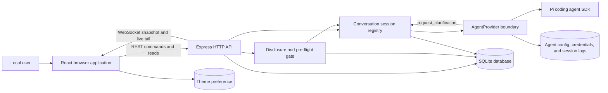
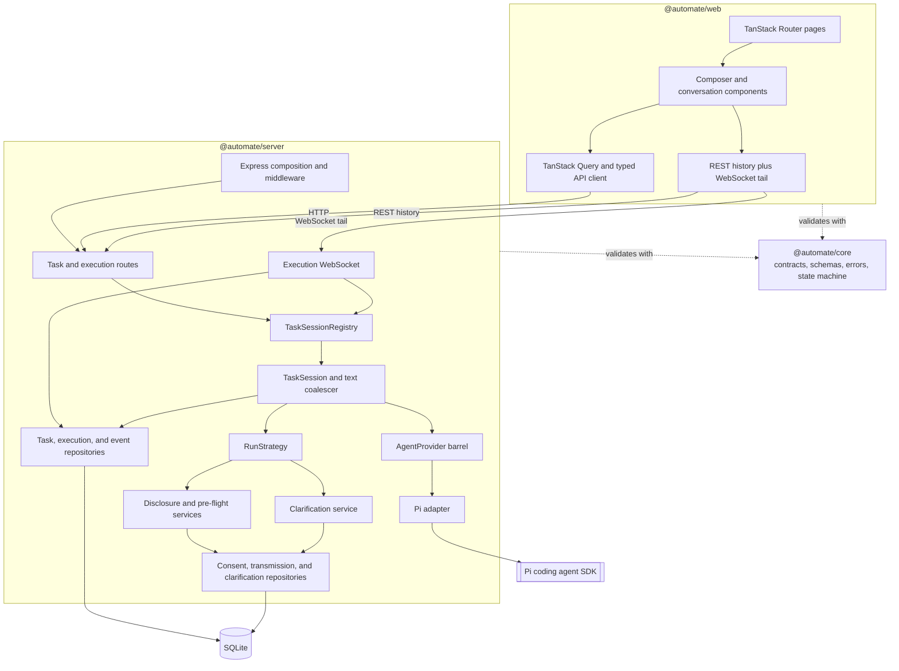
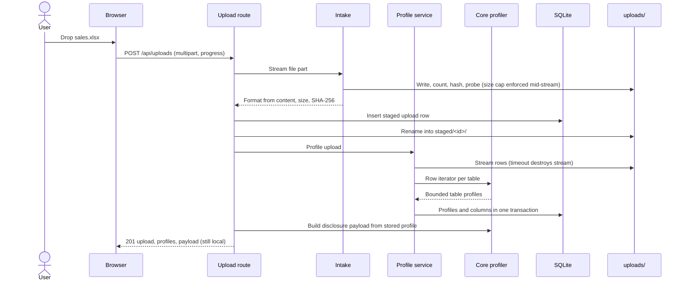
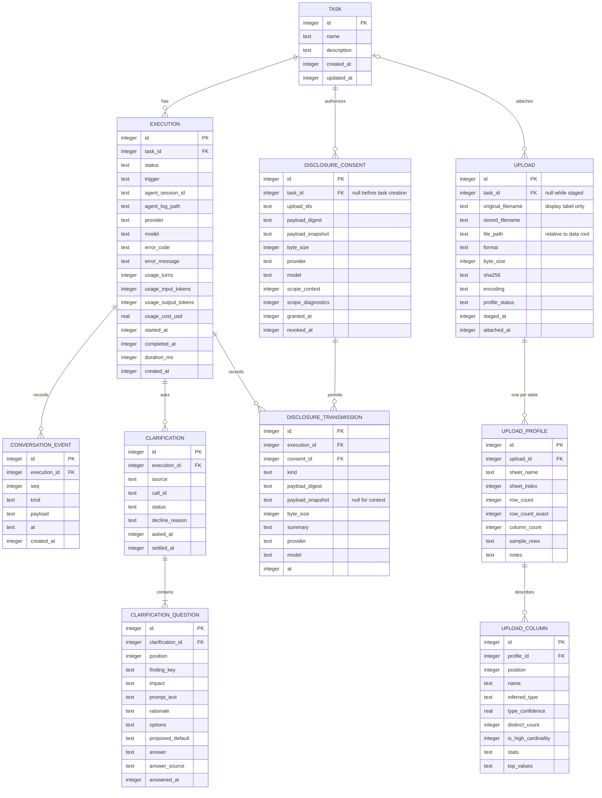

<!-- Generated by spec-lite | skill: document-design -->

# Architecture

## System Context

Auto-Mate is a single-user, local developer preview. The React shell provides task creation, task conversations, History navigation, agent Settings, theme control, and server health status. A person can enter a task, attach CSV or Excel files that are profiled locally, follow the agent conversation, and cancel the active run. The browser uses REST for commands and durable reads and a WebSocket for the server-to-client live tail. The Express server is the authority for task state, execution state, event ordering, and restart recovery.

The server reaches `@earendil-works/pi-coding-agent` only through Auto-Mate's SDK-independent `AgentProvider` contract. Provider events are normalized and sanitized before the conversation layer sees them. The application persists the transcript in SQLite before broadcasting it; the Pi session JSONL remains a local debugging artifact and is never the rendered transcript or an API response.

For a text-only task, the provider receives only the words typed into the task composer. An attached file is read, measured, and profiled locally. Before its bounded description can leave the machine, the browser shows the exact disclosure text and current provider/model, collects every required pre-flight decision, and records an explicit consent. The server binds that consent to the exact upload set, canonical payload digest, provider, and model; it verifies the binding again immediately before opening the provider session and records a transmission receipt. The agent can pause a live run through the application-owned `request_clarification` tool, and the answer becomes part of the durable transcript. There is still no generated-code workflow, script runner, or artifact renderer. The loopback bind and request-origin checks protect the local application surface, but they are not a generated-code isolation boundary.



## Components

The pnpm workspace has three TypeScript ESM packages with one-way dependencies from the web and server packages into the browser-safe core package.

- `@automate/core` owns TypeBox API schemas, the ten-member `ConversationEvent` contract, the WebSocket message union, typed errors, and the execution transition table. It also owns the pure disclosure policy: canonical serialization and digest inputs, exact disclosure rendering, consent evaluation, pre-flight ambiguity classification, the default-deny diagnostic filter, and `assemblePromptContext`, the single prompt-context construction boundary. It imports no Node or provider SDK types in the conversation boundary.
- `@automate/web` owns the React 19 shell, TanStack Router pages, TanStack Query data access, and the conversation presentation. The New task route combines the task composer and attachment intake with a blocking disclosure review that renders the literal payload, recipient, required choices, applied defaults, truncation notices, and the separate diagnostics scope. `/tasks/$taskId` renders ordered user, assistant, tool, turn, state, failure, disclosure-receipt, and clarification events; a pending clarification is answered as one batch, and a waiting banner exposes the existing abort action. `/settings` reads and updates provider/model selection and runs a live connection test, while the shell polls server health. Assistant markdown is rendered without raw HTML, while file values, clarification text, diagnostics, and tool payloads render as text. Semantic `ds.*` tokens provide styling.
- `@automate/core` also owns the pure ingestion logic (FEAT-104): format, encoding, and CSV dialect detection, cell and column type inference, the bounded single-pass column accumulator, the table profiler, and the disclosure payload builder. It is browser-safe and does no I/O; the server feeds it byte buffers and row iterators.
- `@automate/server` owns startup, Express routes, SQLite repositories, live sessions, transport, the Pi adapter, the ingestion pipeline, and the disclosure boundary. `DisclosureService` rebuilds previews from stored profiles and the current recipient, grants exact approvals, and verifies them again for transmission. `PreflightService` re-derives meaning-changing findings server-side. `DisclosureRunStrategy` assembles approved context, records the context receipt before the provider is opened, and registers `request_clarification`. `ClarificationService` durably records batches and answers while keeping only the live blocked promise in memory. The ingestion directory imports nothing from the agent layer and makes no network call; a test enforces both. Routes depend on repositories and the conversation or agent barrels rather than directly on provider SDK internals.

`TaskSessionRegistry` enforces one live `TaskSession` per execution and the configured concurrency limit. Sessions in `waiting` remain live but do not occupy an active execution slot; a separate cap bounds parked sessions. A `TaskSession` opens one provider session, records session provenance, consumes normalized events, coalesces consecutive assistant deltas at 100 ms or 1 KiB boundaries, assigns the next per-execution sequence number, persists the event, and then notifies live subscribers. `DisclosureRunStrategy` sends plain user text unchanged for text-only tasks and, for attached files, sends the user request plus the approved payload snapshot and resolved pre-flight answers. It registers the clarification tool for both paths.

The transport boundary is intentionally split. State-changing commands use REST so they pass through correlation-ID error handling and the Origin/Host guard. The WebSocket is server-to-client application traffic only: it sends an initial snapshot, event messages, and execution summaries; inbound application frames are ignored. It also owns heartbeat cleanup and closes slow consumers with a retryable close code.



## Data Flow

Creating a task is an asynchronous handoff, with an additional gate when files are attached. The browser first requests `GET /api/disclosure/preview`; the server rebuilds the exact text and pre-flight findings from persisted profiles and the current provider/model. `POST /api/disclosure/consents` re-derives that preview before storing the approval. `POST /api/tasks` then independently verifies the acknowledgement and all required choices before it attaches the consent and uploads in the transaction that creates the task and first pending execution. A text-only task skips this gate. The registry starts the run without making the HTTP response wait for completion. The browser navigates to the task page, loads task/execution state and paged transcript history over REST, then opens `/api/ws/executions/:id?afterSeq=N` from the last durable sequence it holds.

During a run, the execution moves from `pending` to `generating`, and then to `completed`, `failed`, or `aborted`. An agent clarification adds the reversible `generating -> waiting -> generating` path. `verifying` and `executing` remain reserved for later features. Each application or normalized agent event is appended to `conversation_event` before it is sent to subscribers. The WebSocket supplies a snapshot for the REST-to-socket race window and then the live tail. The browser ignores already-seen sequence numbers; if it detects a gap, receives backpressure close code `1013`, or comes back online, it reloads durable history and reconnects with its cursor.

```mermaid
sequenceDiagram
  actor U as User
  participant B as Browser
  participant R as REST API
  participant G as Session registry
  participant S as TaskSession
  participant A as AgentProvider
  participant D as SQLite
  participant W as WebSocket

  U->>B: Submit task
  opt Attached files
    B->>R: GET /api/disclosure/preview
    R->>D: Rebuild payload and findings from profiles
    R-->>B: Exact text, recipient, digest, decisions
    U->>B: Approve payload and answer decisions
    B->>R: POST /api/disclosure/consents
    R->>D: Re-derive and store exact approval
  end
  B->>R: POST /api/tasks
  R->>D: Verify gate; create task and pending execution
  R->>G: Start execution
  R-->>B: 201 task and execution
  G->>S: Create one live session
  S->>D: Persist pending to generating event
  opt Attached files
    S->>D: Verify consent and append transmission receipt
  end
  S->>A: open() and run(assembled prompt)
  B->>R: GET task, execution, and event pages
  R->>D: Read durable state and transcript
  R-->>B: Current history
  B->>W: Connect with afterSeq
  W->>D: Read events after cursor
  W-->>B: Snapshot
  A-->>S: Normalized agent event
  S->>D: Append event with next seq
  S-->>W: Notify subscriber after commit
  W-->>B: Event and execution update
  opt Agent requests clarification
    A->>S: request_clarification batch
    S->>D: Persist questions; mark waiting
    S-->>W: Clarification and state events
    B->>R: POST /api/clarifications/:id/answers
    R->>D: Persist all answers; mark generating
    R-->>S: Resolve blocked tool call
  end
  A-->>S: Terminal result
  S->>D: Persist terminal state and event
  W-->>B: Final update, close 1000
```

Ingesting and profiling a file is a separate, earlier flow that involves no provider. `POST /api/uploads` streams one multipart file to `uploads/staged/`, counting, hashing, and probing the bytes in one pass and aborting the moment the size limit is passed. The first 64 KiB decide the format from content. A row is then created and the file renamed to `uploads/staged/<id>/<id>-<name>`. Next the profile service opens a streaming reader under a timeout that destroys its stream. `profileTable` in core consumes the rows once, keeping bounded aggregates and the first 10 rows, and the profiles are stored with their columns in one transaction. The upload response carries the profiles and bounded payload, but nothing is transmitted until the later review and consent flow. `POST /api/tasks` with `uploadIds` verifies and claims every upload inside the transaction that creates the task, then renames the files into `uploads/<taskId>/` after commit.



The disclosure path uses stored bytes instead of reconstructing approved context at send time. `assemblePromptContext` permits only the user request, an approved disclosure snapshot, filtered diagnostics, and application-authored text. The active run strategy uses the first, second, and fourth sources. The diagnostic filter and receipt path are implemented for the future repair loop, but no current execution path invokes a repair or sends diagnostics. The filter is default-deny: it keeps recognized traceback/check structure, masks quoted literals and long number runs, drops unrecognized lines, and caps the result.

Agent clarification batches require a rationale, a `meaning` or `data_loss` impact, and a proposed default for every question. The server counts persisted agent questions and allows at most three by default. It declines an over-budget batch, or one that would exceed waiting capacity, records the decline, and returns the proposed defaults to the agent. An accepted batch moves the execution to `waiting`; the provider tool call remains blocked until the complete answer batch arrives. The parked session is excluded from active concurrency accounting.

Cancellation uses `POST /api/executions/:id/abort`. The registry delegates to the live provider session and returns the settled execution. A terminal execution returns `EXECUTION_NOT_RUNNING`; a non-terminal database row with no live session returns `EXECUTION_INTERRUPTED`.

Recovery has explicit outcomes:

| Event                       | Implemented outcome                                                                                                                                                                                                                                         |
| --------------------------- | ----------------------------------------------------------------------------------------------------------------------------------------------------------------------------------------------------------------------------------------------------------- |
| Browser disconnect          | The server-side run continues. Reconnection replays events after the browser's last sequence and resumes the live tail.                                                                                                                                     |
| Server restart during a run | Before listening, startup marks every active execution, including `waiting`, `failed` with `EXECUTION_INTERRUPTED`, interrupts any pending clarification, and appends a final `state_changed` event. Provider sessions and in-memory waits are not resumed. |
| Graceful shutdown           | The registry asks every live session to abort, waits up to five seconds, and marks any still-active row interrupted before closing sockets and SQLite.                                                                                                      |
| Slow or half-open socket    | Backpressure closes with `1013` so the browser reloads history; heartbeat terminates a connection after two missed pong intervals.                                                                                                                          |
| Multiple browser clients    | Each client receives the same persisted sequence; disconnecting one subscription does not stop the execution or other clients.                                                                                                                              |

## Data Model

SQLite is the durable source for application metadata, task definitions, execution summaries, and the displayed conversation. Drizzle defines the schema and the server applies committed migrations in-process. The connection enables WAL and foreign-key enforcement.



- `task` stores the trimmed plain-language request and a deterministic display name derived from its first useful line.
- `execution` owns the state machine, provider/model provenance, optional sanitized failure, optional usage, and timings. Its `agent_log_path` is persisted for local diagnostics but excluded from browser contracts.
- `conversation_event` is the append-only transcript. `(execution_id, seq)` is unique and indexed; `seq` is the replay cursor and browser deduplication key. `payload` stores the complete JSON event, while `kind` and `at` support integrity and inspection.
- Deleting a task cascades to its executions and events. `execution(task_id)` supports task history, and a partial index over active statuses supports restart reconciliation.
- `upload`, `upload_profile`, and `upload_column` (FEAT-104) describe input files. Columns are rows rather than JSON so a later re-run can compare inputs by query. A `CHECK` constraint makes the D04 rule a data fact: a high-cardinality column holds no distinct count and no frequent values. `(upload_id, sheet_index)` and `(profile_id, position)` are unique. A partial index over unattached uploads serves the orphan sweep. Deleting a task cascades through all three tables, and the sweeper removes the task's upload folder, because cascades do not touch files.
- `disclosure_consent` is an immutable approval of one sorted upload set, exact payload snapshot and digest, recipient, and context/diagnostic scopes. It starts with a null `task_id` because approval precedes task creation, then is attached inside the task transaction. Revocation is represented without deleting the audit record.
- `disclosure_transmission` is the append-only receipt linked to both execution and consent. A context row stores the approved digest but reuses the consent snapshot; a diagnostics row stores its filtered snapshot. Checks constrain kinds and snapshot nullability, while the repository transaction independently rejects a revoked consent, recipient mismatch, or context-digest mismatch.
- `clarification` stores either an answered pre-flight batch or an agent batch with pending, answered, declined, cancelled, or interrupted status. `clarification_question` preserves order, impact, rationale, options, proposed default, answer, and answer source. Schema checks exclude cosmetic impact and constrain answer provenance to user, default, or seeded.
- `app_meta` remains the key/value store for schema version, application version, and installation time. Drizzle also maintains its migration table.

The broader `.spec-lite/data_model.md` remains a proposal and includes deferred tables that are not present. There are currently no artifact, schedule, template, tool-registry, code-version, verification, or script-run tables.

## Key Design Decisions

- **Shared application contracts:** TypeBox schemas, browser-safe types, and typed errors live in `@automate/core`, so the browser and server validate the same health, agent, task, execution, event, and error shapes.
- **One agent seam and one SDK adapter:** Application code consumes `AgentProvider.open(options)` and normalized events. Pi session construction and model lookup stay under `packages/server/src/agent/adapters/pi/`; ambient Pi settings, prompts, skills, and extensions are not loaded into an Auto-Mate session.
- **Application-owned configuration:** Provider/model selection lives in `config/agent.json`; managed credentials live under `pi/`, or the user can opt into a personal Pi credential file. Credential values are not returned by APIs, rendered, or logged.
- **Explicit local storage boundary:** `AUTOMATE_HOME` overrides `~/.automate/`. OS-aware path construction and `resolveWithin` keep execution session directories beneath `agent-sessions/`. SQLite uses `node:sqlite` behind Drizzle with WAL and foreign keys.
- **Correlated API errors:** Middleware accepts a bounded inbound correlation ID or creates one, and one error handler returns the stable public envelope while hiding unexpected internal details.
- **Application-owned React conversation UI:** FEAT-103 does not adopt `@earendil-works/pi-web-ui`. React components render Auto-Mate's normalized event contract directly, avoiding a second browser-side Pi stack and keeping SDK types behind the server adapter.
- **Server-owned replayable state:** SQLite, not the browser or raw Pi JSONL, is authoritative. A single live writer assigns a monotonic per-execution `seq`, and the database uniqueness constraint catches violations.
- **Persist before broadcast:** A client never receives a conversation event that cannot subsequently be replayed from the database.
- **REST commands, WebSocket progress:** Commands retain correlation IDs, validation, and the common error envelope. The socket is a resumable, server-to-client tail rather than a second command API.
- **Explicit restart semantics:** In-memory provider sessions are not reconstructible. Startup therefore converts active rows to a readable interrupted failure instead of leaving stale `generating` state or pretending to resume.
- **Origin and Host validation:** State-changing REST routes and WebSocket upgrades accept the local application origins plus explicitly configured origins. Missing Origin is allowed for non-browser clients; an unrecognized or `null` Origin is rejected. This mitigates browser cross-site requests and DNS rebinding against the loopback service, but it is not authentication or code isolation.
- **Local profiling, bounded disclosure (D04):** Ingestion runs in Node, not Python, so it works before any Python runtime exists. What may ever leave the machine is one bounded artifact: at most 10 sample rows with 200-character cells, frequent values only for columns under 1,000 distinct values, and 64 KiB in total, degraded in a fixed, recorded order. The bound is enforced in the accumulator, the repository, the payload builder, and the schema.
- **Exact, recipient-bound approval:** The preview digest covers the rendered disclosure text, sorted upload ids, provider, and model. Consent is checked once before task creation and again before prompt construction. The provider receives the approved snapshot rather than a re-rendered payload, and a receipt is inserted before the session is opened.
- **One prompt-context chokepoint:** `assemblePromptContext` admits only user text, approved disclosure bytes, filtered diagnostics, and application-authored context. Pi adapter details and arbitrary provider output cannot be injected as file context through this boundary.
- **Default-deny diagnostics:** Repair support can retain only recognized traceback frames, exception types, static-analysis findings, and test-failure structure. Literals and long number runs are masked, unknown lines are counted and dropped, and the filtered text requires the separately granted diagnostics scope. This is an implemented seam; the current application has no repair loop that calls it.
- **Questions are structural, bounded, and durable:** Pre-flight classification asks only about meaning or data-loss ambiguity and caps the blocking screen at three required findings, demoting the remainder to disclosed defaults. Agent questions use one typed custom tool, require rationale and a proposed default, and are counted from persisted rows. The default cap is three questions per execution.
- **Waiting is parked, not terminal:** An accepted agent question moves `generating` to `waiting` while its tool call remains open. Waiting sessions do not consume the active concurrency limit but are bounded separately. Answers restore `generating`; abort, shutdown, or restart settles the wait explicitly instead of leaving an orphaned pending row.
- **Streaming workbooks only:** XLSX files are read with exceljs's streaming reader, with an inflation budget, a shared-string budget, a row cap, and a parse timeout guarding against decompression bombs. The in-memory loader is never used.
- **Bounded live transport:** Assistant deltas are coalesced before sequencing, socket buffers are capped, and heartbeat cleanup prevents abandoned clients from consuming resources indefinitely.
- **Configurable preview concurrency:** `AUTOMATE_MAX_CONCURRENT_EXECUTIONS` defaults to one. The value is provisional pending the wider operational-limits decision.
- **Safe presentation boundary:** Raw HTML is disabled for model markdown, tool input/output is text, raw provider logs are not served, and API summaries expose no session-log path. Normalized provider payloads have already crossed FEAT-102's sanitizer.

## Deployment and Runtime

`pnpm dev` starts the Express process through `tsx watch` and the Vite development server together. Express defaults to `127.0.0.1:4317`; Vite serves the SPA at `127.0.0.1:5173` and proxies `/api` to the server. The application requires Node `>=24.15.0 <25`, uses a committed pnpm lockfile, and is ESM-only.

Startup runs prerequisite checks, resolves `AUTOMATE_HOME` (default `~/.automate/`), creates the durable directory layout, opens SQLite, applies migrations, composes ingestion, disclosure, clarification, conversation, and provider services, reconciles interrupted executions and pending clarifications, sweeps orphaned uploads (and schedules the sweep hourly), then begins listening and attaches the execution WebSocket to the same HTTP server. `SIGINT` and `SIGTERM` cancel clarification waits and drain live sessions before detaching sockets and closing the database.

| Setting                                                    | Runtime effect                                                                                                                                                                       |
| ---------------------------------------------------------- | ------------------------------------------------------------------------------------------------------------------------------------------------------------------------------------ |
| `AUTOMATE_HOME`                                            | Overrides the application data root.                                                                                                                                                 |
| `AUTOMATE_HOST`, `AUTOMATE_PORT`                           | Set the Express bind address and port.                                                                                                                                               |
| `AUTOMATE_MAX_CONCURRENT_EXECUTIONS`                       | Sets the positive integer live-session cap; default `1`.                                                                                                                             |
| `AUTOMATE_MAX_WAITING_EXECUTIONS`                          | Caps parked clarification waits; provisional default `5`.                                                                                                                            |
| `AUTOMATE_MAX_AGENT_CLARIFICATIONS`                        | Caps persisted agent questions per execution; provisional default `3`.                                                                                                               |
| `AUTOMATE_MAX_PREFLIGHT_DECISIONS`                         | Parses a provisional limit; the current classifier uses its core default of `3`.                                                                                                     |
| `AUTOMATE_MAX_DIAGNOSTIC_BYTES`                            | Parses a provisional limit; the current filter uses its core default of `8 KiB`.                                                                                                     |
| `AUTOMATE_ALLOWED_ORIGINS`                                 | Adds comma-separated browser origins accepted by the local-access guard.                                                                                                             |
| `LOG_LEVEL`                                                | Sets Pino logging verbosity.                                                                                                                                                         |
| `AUTOMATE_MAX_UPLOAD_BYTES` and the other ingestion limits | Bound upload size, files per task, rows, columns, sheets, parse time, workbook expansion, and staged-upload lifetime; see [ingestion limits](features/csv-xlsx-ingestion.md#limits). |

Durable state lives under the application data root: `data/automate.db`, `config/agent.json`, managed Pi files under `pi/`, and raw SDK logs under `agent-sessions/<executionId>/`. Uploaded files live under `uploads/staged/` until a task claims them and under `uploads/<taskId>/` afterwards. Startup also creates `artifacts/`, `scripts/`, and `env/` for later features.

`pnpm build` type-checks core and server and builds the Vite client. The repository still has no production static-file host, container configuration, authentication layer, or restricted script-execution boundary.
